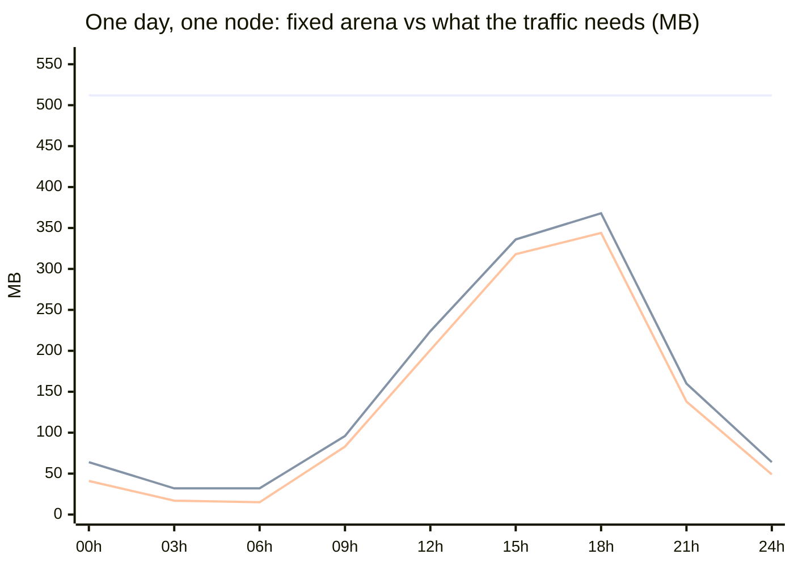
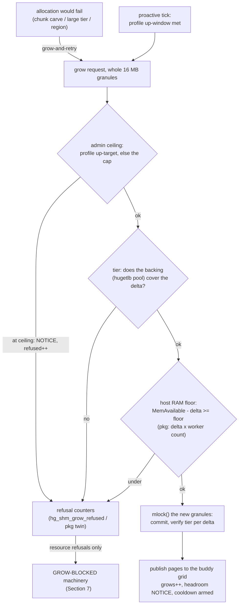
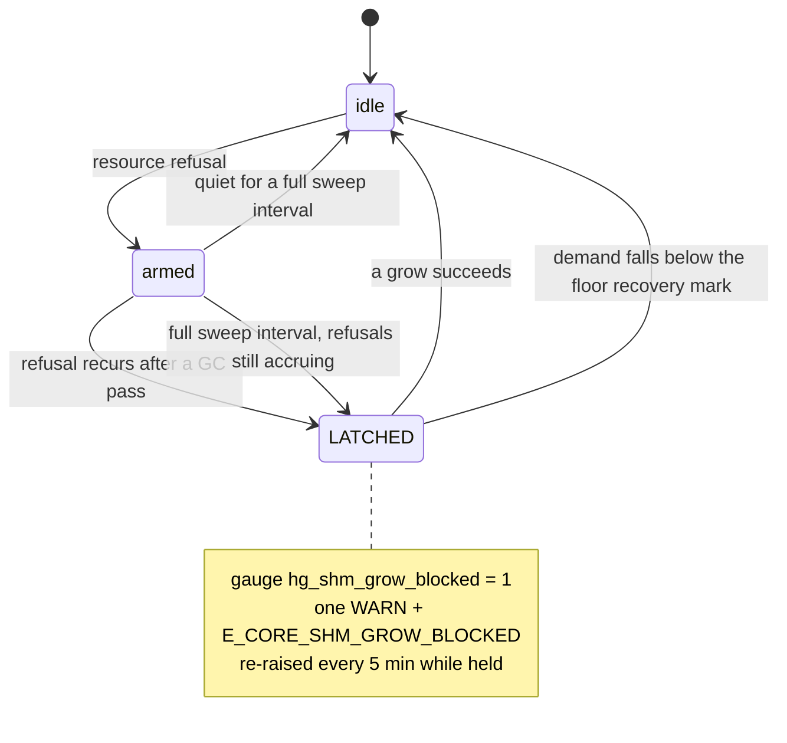
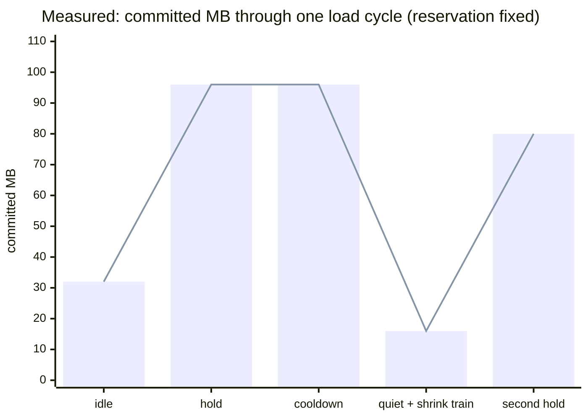
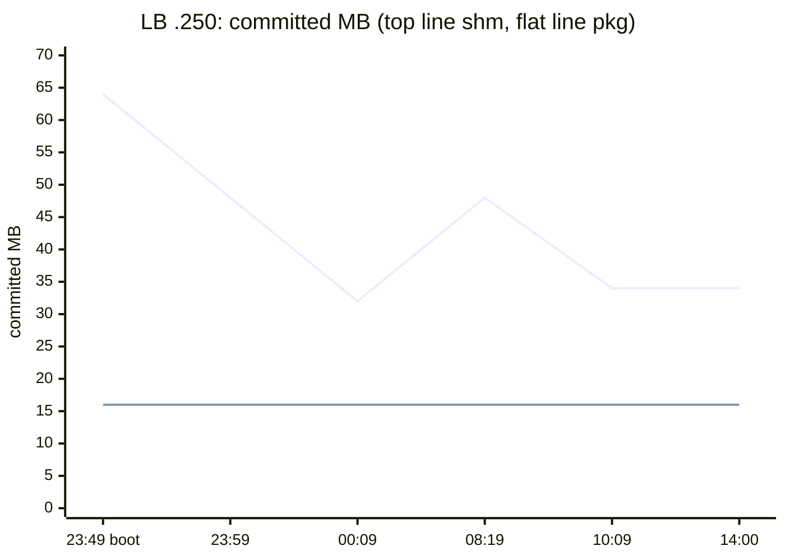
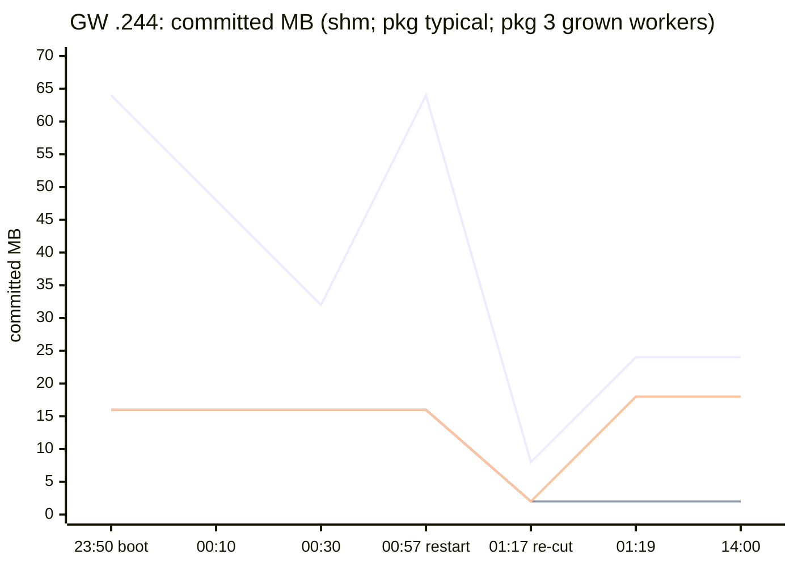

# HG_MALLOC v3 — the elastic arena

HG_MALLOC v3 lets the shared-memory and per-process arenas **grow and
shrink at runtime**, between a starting size and a cap you reserve up
front. Undersizing no longer fails allocations at 3 a.m., and
oversizing no longer pins gigabytes of RAM around a workload that needs
megabytes — the arena follows the load, within limits you set, with
every decision observable and alertable.

With no cap configured, **nothing changes**: the arena is fixed at
`-m`/`-M`, byte-for-byte the v2 behaviour.

```
                 hcap (the -m INIT:CAP reservation)
  ┌────────────────────────────────────────────────┐
  │ committed (usable, pinned)  │  reserved only   │
  └─────────────────────────────┴──────────────────┘
   ↑ starts at INIT      grows →      ← shrinks
     never below the shrink floor, never above the ceiling
```

## 0. Why an elastic arena

Every OpenSIPS deployment ships with two numbers somebody guessed:
`-m`, the shared-memory arena all calls, dialogs and caches live in,
and `-M`, the private arena **each worker process** gets. Both are
fixed at boot. Both are a bet.

**Bet low and you lose at the worst possible moment.** Shared memory
exhausts in the middle of your best traffic hour: allocations fail,
calls drop, and the only fix is a restart with a bigger number —
downtime, during the incident, on every node it touches.

**Bet high and you pay for it every quiet hour.** The arena is pinned
physical memory; on the hugetlb tier it is carved out of the host at
boot and nothing else can ever use it. A production load balancer we
measured peaks at **11.9 MB** of shm over 15 hours of full traffic —
inside a 128 MB fixed arena. And `-M` multiplies: 16 MB across one
gateway's 54 workers is **864 MB** of committed RAM backing arenas that
mostly hold under 3 MB each, because with a fixed `-M` you size *every*
worker for the *busiest* worker's worst minute.

And the bet cannot be won, because the right number is a moving
target — it shifts with traffic mix, dialog lifetimes, the module set,
the season:



*Top, flat: a fixed `-m 512` sized for the storm, paid around the
clock. Middle, stepped: what v3 keeps committed — granule steps up
under load, shrink lagging the peak by the quiet window. Bottom: live
demand. (Illustrative shapes; a measured cycle is charted in
Section 8.)*

v3 replaces both bets with a **range**: `-m 64:512 -M 16:32`. Start at
the size you can defend, reserve the ceiling (address space — free),
commit physical pages only as demand arrives, hand back what goes
quiet. Growth stops at three independent limits — your policy, the
backing tier, the host's real free RAM (pkg charged × the worker
count). Every decision is a counter you can scrape, the one state that
deserves a page is a latched event, and a dry-run mode narrates what it
*would* have done before you let it do anything.

Every mechanism below was chosen **by measurement first** — including
two designs that looked right on paper and were proven memory-corrupting
before a line of allocator code was written. The log lines, MI output
and numbers in this document are real captures from the proof rigs, not
mockups.

**Contents**

0. [Why an elastic arena](#0-why-an-elastic-arena)
1. [Quickstart](#1-quickstart)
2. [Concepts and architecture](#2-concepts-and-architecture)
3. [Why the cap is on the command line](#3-why-the-cap-is-on-the-command-line)
4. [The memory tiers](#4-the-memory-tiers)
5. [Growth](#5-growth)
6. [The three-limit ceiling](#6-the-three-limit-ceiling)
7. [GROW-BLOCKED — the alertable state](#7-grow-blocked--the-alertable-state)
8. [Shrink](#8-shrink)
9. [The profile — configuration reference](#9-the-profile--configuration-reference)
10. [Dry-run mode](#10-dry-run-mode)
11. [pkg arenas — what is different](#11-pkg-arenas--what-is-different)
12. [Deployment cookbook](#12-deployment-cookbook)
13. [Monitoring and alerting](#13-monitoring-and-alerting)
14. [Log line reference](#14-log-line-reference)
15. [Sizing rules that are not obvious](#15-sizing-rules-that-are-not-obvious)
16. [Troubleshooting](#16-troubleshooting)
17. [Testing — the rig and how to reproduce the proofs](#17-testing--the-rig-and-how-to-reproduce-the-proofs)
18. [Appendix A — measured kernel facts](#18-appendix-a--measured-kernel-facts)
19. [Appendix B — internals map for developers](#19-appendix-b--internals-map-for-developers)
20. [Limitations](#20-limitations)

---

## 1. Quickstart

```bash
# 128 MB now, allowed to grow to 1 GB:
opensips -f opensips.cfg -m 128:1024 -M 16:64 -a HG_MALLOC
```

That alone gives you **exhaustion-triggered growth**: an allocation that
would have failed instead commits one 16 MB granule more and retries,
up to the cap. Loudly:

```
NOTICE:core:hg_malloc_init: shm HG_MALLOC_V3 arena: 128 MB on MAP_HUGETLB 2M pages, 128 MB pinned from swapping
NOTICE:core:hg_malloc_init: shm arena can grow to 1024 MB (896 MB headroom reserved, uncommitted)
...
NOTICE:core:hg_buddy_grow: shm arena grew by 16 MB to 144 MB (8 new pages on MAP_HUGETLB 2M pages; 880 MB headroom left)
```

Add a policy and it also grows **before** anything fails, and gives
quiet memory back:

```
auto_scaling_profile = MEM_SHM
    scale up to 1024 on 80% for 3 cycles within 10
    scale down to 256 on 30% for 120 cycles

auto_scaling_profile = MEM_PKG
    scale up to 64 on 80% for 2 cycles within 5
    scale down to 8 on 20% for 60 cycles

shm_auto_scaling_profile = MEM_SHM
pkg_auto_scaling_profile = MEM_PKG
```

The pkg profile governs **every worker's private arena individually**,
so its numbers are per-worker scale — an order of magnitude below the
shared arena's (Section 11).

Watch it work:

```bash
opensips-cli -x mi core:hg_stats           # committed / cap / grows / shrinks / tiers
```

---

## 2. Concepts and architecture

### 2.1 Committed vs reserved

The arena block (`struct hg_block`) carries two sizes:

| field | meaning |
|---|---|
| `hsize` | **committed** — pre-faulted, pinned, published to the buddy allocator, usable |
| `hcap`  | **reserved** — the size of the one mapping created at startup |

`hcap == hsize` (no `:CAP` given) is a fixed arena — exactly v2.

### 2.2 The one invariant everything rests on

**The whole cap is mapped once, `MAP_SHARED`, before fork.** Growth and
shrink never create, destroy, or re-protect mappings — they only change
which parts of that one shmem object are populated.

This is forced, not stylistic. `mmap()` and `mprotect()` edit **one
process's page tables**, and the shm arena is shared by ~30 workers
that forked before any growth happens. The "obvious" design — keep the
tail `PROT_NONE` and `MAP_FIXED` deltas in on demand — was implemented
as a userspace rig first and **measured to be memory-unsafe in both
directions** on the fleet's oldest kernel (5.4):

* **Growth** via post-fork `MAP_FIXED`: the grower reads its new pages
  fine; a worker that forked earlier still has `PROT_NONE` there and
  **SIGSEGVs** on the first cell handed out of grown space. (Control
  arm: the pre-fork committed prefix was visible in the same worker.)
* **Shrink** via `mmap(PROT_NONE|MAP_FIXED)`: it rebinds only the
  caller's mapping. Measured: after the shrinker released and re-grew a
  range and wrote `0x77`, another worker **still read the old `0xEE`**
  — two processes silently disagreeing about one arena address.

With the whole-cap mapping, growth is a *commit* (populate + pin) and
shrink is a *punch* (`madvise`) on the shared object — both visible to
every process by construction. The untouched reserved tail costs only
page-table entries: a 64 MB mapped-untouched span was measured at
**576 kB of RSS**.

### 2.3 The buddy grid grows without moving metadata

The buddy allocator's per-page descriptors (`struct hg_page`,
leaf-order arrays, bitmaps) are laid out at init **for the full cap**
(`npages_cap`), not just the committed pages. The overhead is ~0.05% of
each never-committed page, paid up front — and it means a grow only
*publishes* pages that already have descriptors. The alternative would
be finding room for metadata in an arena that is, by definition of why
it is growing, full.

Each page descriptor also carries the **achieved backing tier of the
commit that brought it in** (one byte, fits existing padding) — that is
what keeps the per-tier accounting truthful in both directions, since
shrink releases top pages that may come from any delta.

### 2.4 The ownership registry records the cap

`hg_arena_reg[]` (the cross-arena pointer-ownership table used on free
paths) records `hcap`, not `hsize`. Growth must never invalidate a
registry entry, or a pointer into freshly grown space would be misread
as foreign and "routed" to another arena. The whole cap's address range
belongs to this arena from reserve time; uncommitted ranges cannot hold
live cells, so the wider range cannot misattribute anything that
exists.

---

## 3. Why the cap is on the command line

The shm arena is created **before the config file is parsed**
(`init_shm_mallocs()` runs before `parse_opensips_cfg()` in `main()`),
and on the hugetlb tier the whole cap is reserved from the kernel's
page pool **at `mmap()` time** (measured — see Appendix A). There is no
later moment at which a config value could still shape the reservation.

So the reservation lives where sizing always has:

```
-m INIT[:CAP]        shared memory, MB
-M INIT[:CAP]        per-process private memory, MB
```

`CAP` is rounded up to whole huge pages and must be ≥ `INIT` (refused
otherwise, at option parsing). Omitting `:CAP` pins the arena at
`INIT`.

The config then supplies **policy within the reservation** — resolved
and validated in `init_shm_post_yyparse()`, the same post-parse hook
HP_MALLOC uses for memory warming. A profile can never raise the cap;
it can only choose how the space inside it is used.

---

## 4. The memory tiers

The arena tries four backings in order, each **attempted and then
verified through `/proc`** — never inferred from kernel version or
sysfs configuration:

| tier | mechanism | verification | properties |
|---|---|---|---|
| 1 | `mmap(MAP_HUGETLB)` | mmap success | unswappable by construction; pool-accounted |
| 2 | `MADV_HUGEPAGE` before first touch | `/proc/self/smaps` PMD-mapped | THP at fault |
| 3 | `MADV_COLLAPSE` after fill | `ShmemHugePages` delta | THP retrofitted |
| 4 | plain 4 K | — | always works; mlock-pinned |

Two v3-specific rules:

* **Every growth delta re-negotiates its own backing.** A THP arena's
  delta may land on 4 K next to memory that got 2 M at init. Backing is
  an *outcome per range*, never an attribute of the arena — which is
  why `hg_stats` reports a `tier_bytes` split whenever more than one
  tier holds bytes, instead of one label that would be a lie.
* **Tier 1 reserves the whole cap from the pool at map time**
  (measured: mapping 64 MB moved `HugePages_Rsvd` by exactly 32 pages
  before any fault). Consequences: tier-1 growth can never fail
  mid-flight — the pages are earmarked — and the pool must be sized for
  the **caps** (Section 15). If the pool cannot fit the cap, the arena
  falls back to a cap-less hugetlb reservation: it keeps huge pages,
  cannot grow, and says so.

Measured cost context (same workload, `perf` self-time across allocator
symbols): tier 1 ≈ 2.78%, tier 2 ≈ 2.97%, tier 3 ≈ 3.07%, tier 4 ≈
3.38% — against F_MALLOC 7.56%. Huge pages are the smaller half of the
win; losing a delta to 4 K is a percent, not a disaster.

---

## 5. Growth

Two triggers, one mechanism.

**Exhaustion (always armed once a cap exists).** The three points where
an allocation can die of buddy exhaustion — small-object chunk carving,
the large tier, region allocation — each grow-and-retry exactly once.
If the arena grew, the freshly published whole pages satisfy the retry
by construction; a second miss can only mean the grow itself was
refused, and the caller's ordinary exhaustion error follows.

**Proactive (with a profile).** Once per sweep interval (30 s), usage
(carved-of-committed) is compared to the profile's up-threshold using a
cycles-in-window count. Crossing it grows one granule **before any
allocation fails**. The exhaustion path stays armed for bursts between
ticks.

The commit itself (`hg_mem_commit()`):

1. optional host-RAM check (Section 6) — before any work;
2. `mlock()` of the delta — chosen because it populates *exactly* that
   range, pins it, and reports failure through `errno` instead of
   letting a worker SIGBUS later on half-committed memory. Growth is
   **refused, never degraded**;
3. per-delta tier verification (Section 4), `tier_bytes` accounting;
4. only then: `hsize` moves, pages are published, the reserve floor is
   recomputed, counters tick.

The pre-fault runs under the arena lock — a deliberate, bounded trade.
Growth is once per granule of genuine demand; every other worker in the
slow path at that moment is *also* out of memory and would only queue
on the same growth.

Granule: 16 MB (huge-page rounded).

---

## 6. The three-limit ceiling

`min(admin, tier, host RAM)` — each limb enforced where it is real:

| limb | what | where enforced |
|---|---|---|
| admin | the profile's scale-up target, else the `-m` cap | `hg_buddy_grow()` — refusing it is a NOTICE, never an alert: a limit doing its job is not an incident |
| tier | hugetlb pool | **at reserve time** (map-time pool reservation — measured); tiers 2–4 additionally by `mlock`'s own errno |
| host RAM | `MemAvailable` vs a floor | `hg_grow_ram_refused()` before each commit |

The RAM floor defaults to `max(256 MB, MemTotal/20)`, configurable:

```
hg_ram_floor_mb = 2048
```

Tier 1 **skips** the RAM limb outright: its pages were carved out of
host RAM when the pool was created — charging them again would
double-count (also measured, not assumed).

**pkg deltas are charged × the process count**: every worker grows its
own private arena under the same workload, so the single-arena delta
understates the real host cost ~30× on a gateway. Verified
differentially — with one floor, a 16 MB pkg delta was refused while
16 MB shm deltas grew:

```
WARNING:core:hg_grow_ram_refused: pkg: refusing to grow by 16 MB: 144 MB effective (x9 processes) would leave the host under the 14589 MB floor (MemAvailable 14562 MB). Freeing host memory or lowering the floor lifts this.
```

The whole grow path, trigger to publish:



---

## 7. GROW-BLOCKED — the alertable state

A **resource** refusal (host RAM, mlock limit — not an admin ceiling)
should page someone *only if it means something*. The state machine:



Two latch routes exist because of a measurement: the original
"survived a GC pass" rule alone sat through **5 million refusals with
`gc_passes == 0`** — a full arena where nothing is reclaimable is
exactly the state that most needs the alert, and it never runs GC. The
sweep timer is therefore a second promoter: armed + still refusing a
full interval later ⇒ latch.

The hysteresis was verified in both directions: isolated
one-refusal-per-interval spikes never latch (each arming is disarmed by
the next quiet tick); a sustained stream latches.

Surfaces: the `hg_shm_grow_blocked` **gauge** (the alertable one), one
WARN log line, and the `E_CORE_SHM_GROW_BLOCKED` event — raised **from
the sweep timer**, never under the arena lock: `evi_raise_event()`
allocates shm, and raising it inside the allocator that just refused to
grow would re-enter a full arena.

```
event_route[E_CORE_SHM_GROW_BLOCKED] {
    xlog("L_WARN", "arena $param(arena) blocked: committed $param(committed_mb)MB / cap $param(cap_mb)MB, $param(grow_refused) refusals\n");
}
```

The event is published with the other core events unconditionally, so
`event_route` can always subscribe; only the *raise* is conditional.
Shm arena only, honestly so: each pkg arena's state is private to its
process (its WARN appears in that worker's log, its counters in its own
`hg_stats` pkg section).

Log flood protection is separate from the latch and applies everywhere:
refusal details are logged **once per episode** (re-armed by the next
successful grow). The first at-cap soak without this printed 239,458
identical NOTICEs in four seconds; the counter carries the magnitude,
the log carries the fact.

---

## 8. Shrink

### 8.1 Why it is safe with zero cross-process coordination

Only pages the buddy proves **wholly free** can be released, and only
from the **top** of the committed range:

* *Whole-free is a proof, not a heuristic.* Buddy merging is eager, so
  an all-leaves-free page has provably merged into one top-order block.
  And a cell parked in any thread's private `__thread` cache has **not**
  decremented its block's live count — that happens only at cache/block
  transitions — so its block is still carved and its page can never
  appear whole-free. Contrapositive: whole-free ⇒ no live pointer into
  the page exists anywhere ⇒ nothing to coordinate.
* *Top-only* keeps `hg_owns()` one contiguous range test and the
  ownership registry valid — the address-space invariants of the whole
  allocator.

### 8.2 The primitive — measured, with the wrong answers named

`munlock()` + `madvise(MADV_REMOVE)` for the shared arena: it punches
the **shmem object**, so every mapped process is affected. Measured on
kernel 5.4:

* frees the pages even while another process holds them `VM_LOCKED`
  (worker RSS dropped by exactly the punched size; re-read returned
  zeroes);
* the range recommits cleanly afterwards (mlock + write, visible
  cross-process);
* on hugetlb, the pages **return to `HugePages_Free`** and are drawn
  back out on re-fault — the pool round-trip.

pkg arenas (`MAP_PRIVATE`) use `MADV_DONTNEED` — per-process memory,
no cross-process question exists.

The one primitive that must never be used is
`mmap(PROT_NONE|MAP_FIXED)` over the range — see 2.2; it was measured
leaving other workers reading stale bytes.

A kernel that refuses the advice latches `shrink_unsupported` once and
the arena simply stays grown — nothing retries, nothing spams.

### 8.3 Ordering and policy

The punch runs **before** any bookkeeping, under the arena lock, so a
refused release changes nothing and no worker can carve from pages
mid-punch. On success: pages leave the free lists and the grid,
`hsize`/`npages`/floor/counters adjust, per-page tiers decrement
`tier_bytes`.

Cadence is down-slow by design: one granule per quiet window
(no-profile default: 4 consecutive quiet sweep intervals = 2 minutes;
with a profile: its own threshold and cycle count). Hard safety
conditions hold regardless of policy — never below the floor, never
while grow-blocked, top page must already be whole-free, and free space
must stay clear of the reserve floor's recovery threshold even after
giving the granule back, so a shrink can never re-trigger the pressure
that would regrow it. Any grow resets the window and starts the
profile's post-grow cool-off (10× the down-cycles).

**Prefer-low allocation** makes tops drain: the top-order free list is
kept in ascending address order, so whole-page carves always take the
lowest free page; multi-page runs already scanned ascending. Lower
orders stay LIFO — their placement belongs to the cell-level
concentration policy, and their lists are the long ones where an
ordered walk would cost.

Floor: never below `-m`/`-M`'s initial size — unless a profile says
otherwise (Section 9): with a profile attached, the profile is the ask
and `-m` is just the starting size.

A full cycle, measured on a live process (rig arm K, Section 17): grow
under MI-driven load, cooldown, the shrink train once the quiet window
passes, regrowth on the next pulse — committed walking 32→96→16→80 MB
while the reservation never moves and the hugetlb pool gets every
released page back:



---

## 9. The profile — configuration reference

v3 reuses the worker autoscaler's grammar — same tokens, same shape
your configs already use for `use_auto_scaling_profile`:

```
auto_scaling_profile = <NAME>
    scale up to <MB> on <pct>% for <C> cycles [within <W>]
    [scale down to <MB> on <pct>% for <C> cycles]

shm_auto_scaling_profile = <NAME>
pkg_auto_scaling_profile = <NAME>       # optional, may be a different profile
hg_ram_floor_mb          = <MB>         # 0 = auto (max(256MB, MemTotal/20))
hg_autoscale_dry_run     = 0|1
```

| element | meaning for an arena |
|---|---|
| `up to N` | growth **ceiling**, MB, huge-page rounded — the admin limb, within the `-m` cap |
| `on P% for C within W` | grow when usage ≥ P% in C of the last W cycles (`within W` omitted ⇒ W = C) |
| `down to M` | shrink **floor**, MB — may be *below* `-m` |
| `on Q% for C` | shrink one granule after C consecutive cycles at ≤ Q% |
| one cycle | one sweep interval (30 s) |
| implicit | post-grow cool-off of 10×C cycles before shrink counting resumes |

Usage is carved-of-committed. Profile numbers are copied **into** the
(possibly shared) arena block at attach — never pointed to; the profile
structs live in process-local memory.

### Validation — fail-loud, all real messages

A profile that cannot work stops startup with the reason:

```
ERROR: shm_auto_scaling_profile 'MEM_SHM' does not name an auto_scaling_profile
ERROR: shm profile 'MEM_SHM': the arena has no growth room - give the reservation on the command line (-m INIT:CAP)
ERROR: shm profile 'MEM_SHM': scale-up target 96 MB does not exceed the initial 128 MB - the profile could never act
ERROR: shm profile 'MEM_SHM': scale-up target 2048 MB exceeds the 1024 MB reservation - raise the :CAP
ERROR: shm profile 'MEM_SHM': scale-down target 2 MB is below the 4 MB minimum viable arena
ERROR: shm profile 'MEM_SHM': scale-down target 512 MB is not below the scale-up target 256 MB
```

A profile named while a different allocator runs is ignored with a
WARN. Every accepted profile announces itself once, so a config's
effect is verifiable from the log alone:

```
NOTICE:core:hg_autoscale_apply: shm auto-scaling profile 'MEM_SHM': 32..160 MB (start 64), up at 60% for 2/3 cycles, down at 20% for 1 cycles (cooldown 10)
```

---

## 10. Dry-run mode

```
hg_autoscale_dry_run = 1
```

Advise-only: ticks **and even emergency exhaustion growth** log what
they would have done and act never — the arena behaves exactly like a
fixed v2 arena while you watch what the policy thinks:

```
NOTICE:core:hg_grow_tick: shm: DRY RUN - would grow (committed 64 MB, usage 97%, profile ceiling 160 MB)
WARNING:core:hg_buddy_grow: shm: DRY RUN - would grow for a 285488 byte request (committed 64 MB); counting further suppressed grows in hg_shm_grow_refused
NOTICE:core:hg_shrink_tick: shm: DRY RUN - would shrink (committed 96 MB, usage 12%)
```

Suppressed grows still count in `grow_refused`, so the *volume* of what
dry-run declined is measurable, not just its existence. Proven: a
dry-run arena at 97% usage under held load produced the advice lines
and **zero** actual grows, committed unchanged.

Deployment pattern: ship the profile with dry-run on, watch a few days,
tune thresholds against the advice lines, flip to 0.

---

## 11. pkg arenas — what is different

* **Per-child, post-config.** Each worker's private arena is created at
  fork time (after the config is parsed), so it takes the full policy:
  cap from `-M INIT:CAP`, profile numbers from a fork-inherited
  resolution.
* **The pre-fork parent arena stays fixed** at `-M`'s initial size — it
  predates the config, and the attendant barely allocates. Documented
  cost: none in practice.
* **Ticks run in the owner.** Only a process can shrink its own private
  arena; the pkg grow/shrink gates tick from each process's sweep-flush
  path, once per interval, same cadence as shm.
* **Host costs multiply.** Both the RAM-floor check (automatic) and
  your capacity plan (manual) must charge pkg deltas × the worker
  count. `-M 16:64` on a 30-worker gateway is up to 1.9 GB of potential
  pinned growth — and on tier 1, the same multiplication applies to
  **pool reservations** (each child's arena reserves its own cap at map
  time).

What the multiplier means on a real 54-worker gateway — to survive one
worker's burst with a fixed `-M` you must hand the burst size to all
54; with a range, the floor is the norm and the burst is one worker's
temporary excursion:

```mermaid
xychart-beta
    title "pkg, 12 of 54 workers: fixed -M sized for the burst vs v3 (MB)"
    x-axis ["w1","w2","w3","w4","w5","w6","w7","w8","w9","w10","w11","w12"]
    y-axis "MB per worker" 0 --> 36
    bar [32,32,32,32,32,32,32,32,32,32,32,32]
    bar [16,16,16,32,16,16,16,16,16,16,16,16]
```



*First bars: fixed `-M 32` because worker 4 once needed 32 —
1,728 MB across 54 workers, around the clock. Second bars: v3 with
`-M 16:32` — 53 workers hold the 16 MB floor, the burst worker grows a
granule and returns it after the quiet window; peak 880 MB. When the
profile's down-target sits below `-M`, the floor drops further still.
(Illustrative; the five-worker independence proof is below.)*

Proven: five workers each grew their own arena 8→24→40 MB
independently, on per-delta-verified THP backing, with every stamped
word intact.

---

## 12. Deployment cookbook

### 12.1 Billing gateway, hugetlb tier

Start at the proven working size, allow storm growth, never shrink
below the start (a gateway holds long-lived state).

```bash
# /etc/default/opensips
MALLOC=HG_MALLOC
SHM_MEMORY=128:1024
PKG_MEMORY=16:32
```

```
# opensips.cfg
auto_scaling_profile = MEM_SHM
    scale up to 1024 on 75% for 2 cycles within 5
    scale down to 128 on 25% for 120 cycles

shm_auto_scaling_profile = MEM_SHM
```

```bash
# /etc/sysctl.d/60-opensips.conf — the pool must fit the CAPS:
#   shm cap:              1024 MB          = 512 pages
#   pkg cap × 31 workers:   32 MB × 31     = 496 pages
#   rounding / restart headroom (~5%)      ≈ 50 pages
vm.nr_hugepages=1060
```

```ini
# systemd drop-in
[Service]
LimitMEMLOCK=infinity
```

Only the caps draw from the pool. The pre-fork (attendant) pkg arena —
the one every child inherits copy-on-write — is deliberately **not**
hugetlb-backed: a child's COW fault inside a hugetlb mapping has no 4K
fallback and no reservation, so an empty pool at fork time was a silent
SIGBUS (measured; it is how TCP main, the last no-script child, died at
startup on a short pool — twice). Its ladder starts at THP instead,
whose COW splits to 4K pages, and no-script children no longer walk the
inherited route AST with `pkg_free` before swapping to their own arena.
Startup therefore cannot SIGBUS on pool state: a short pool only pushes
late children down the tier ladder. If the pool cannot fit a cap:

```
NOTICE: hugetlb pool cannot back a 1024 MB cap; reserving the 128 MB in use instead - the arena keeps huge pages but cannot grow. Raise vm.nr_hugepages to allow growth.
```

### 12.2 Load balancer, measured-first

An LB's real footprint is small (a production LB measured **11.9 MB
peak shm over 15 h** of full traffic; worst per-process pkg 2.4 MB).
Start small, keep storm headroom, hand idle memory back:

```bash
opensips -f lb.cfg -m 64:512 -M 16 -a HG_MALLOC
```

```
auto_scaling_profile = MEM_LB
    scale up to 512 on 70% for 2 cycles within 4
    scale down to 32 on 20% for 20 cycles

shm_auto_scaling_profile = MEM_LB
```

`down to 32` sits below `-m 64` deliberately: after a storm passes, the
arena returns even part of the initial allocation.

### 12.3 First rollout — dry-run

Section 10. Profile + `hg_autoscale_dry_run = 1`, observe, tune, flip.

### 12.4 Cap only, no profile

```bash
opensips -f opensips.cfg -m 256:2048 -a HG_MALLOC
```

Exhaustion growth + conservative built-in shrink (4 quiet intervals per
granule, never below `-m 256`). No proactive behaviour, no config
surface at all.

### 12.5 The first soak, charted

Two nodes, first 14 hours on v3 (2026-08-14/15), every point taken from
the arena's own grow/shrink NOTICE lines. The LB ran the section 12.2
recipe untouched; the gateway was deliberately re-cut mid-soak to a
near-empty start (`-m 8:512 -M 2:32`) to make growth earn everything.



*The 12.2 config doing its job unattended: idle 64 shrinks to the 32
floor within 20 minutes of boot, morning traffic grows it back to 48,
and the after-peak shrink releases only what is genuinely empty —
committed lands on 34, not 32, because 2 MB of the growth still holds a
live allocation ("7 pages released; 2 MB of growth still held"). pkg
never moved on any of the 28 workers. Changes are instantaneous steps;
the slopes are an artifact of the event-spaced axis.*



*The adversarial arm. First boot (`-m 64`) runs the predicted shrink
train to 32; a restart resets to 64; then the re-cut starts shm at
**8 MB** and per-worker pkg at **2 MB**. Demand pulls shm to 24 within
two minutes and exactly three of 54 workers grow their pkg to 18 —
the other 51 stay at the 2 MB floor. Twelve hours of steady state
followed.*

Both nodes, the whole window: `grow_refused` 0, `grow_blocked` 0,
corruption counters 0, tier-1 hugetlb throughout, and the
`E_CORE_SHM_GROW_BLOCKED` event never fired.

---

## 13. Monitoring and alerting

### 13.1 MI

```bash
opensips-cli -x mi core:hg_stats
```

```json
"shm": {
    "tier": "plain 4K pages",
    "committed": 167772160,
    "cap": 268435456,
    "grow_headroom": 100663296,
    "grows": 6,
    "grow_bytes": 100663296,
    "grow_refused": 1,
    "grow_blocked": 0,
    "shrinks": 8,
    "shrink_bytes": 134217728,
    ...
}
```

Field notes:

| field | meaning |
|---|---|
| `tier` | what **init** achieved |
| `tier_bytes` | per-tier byte split — appears only when >1 tier holds bytes; the honest answer to "is my grown arena still on huge pages" |
| `committed` / `cap` / `grow_headroom` | the elastic state; `committed == cap` ⇒ fixed or fully grown |
| `grows` / `grow_bytes` | successful commits and their total |
| `grow_refused` | refusals, both admin and resource — the magnitude counter behind once-per-episode logging |
| `grow_blocked` | the latched gauge (resource refusals only) |
| `shrinks` / `shrink_bytes` | successful releases and their total |

The `pkg` section reports the **answering MI process's own** arena —
stated honestly rather than pretending fleet-wide pkg visibility.

### 13.2 Statistics (Prometheus-friendly)

```
hgmem:hg_shm_committed      bytes committed right now
hgmem:hg_shm_cap            the reservation
hgmem:hg_shm_grows          counter
hgmem:hg_shm_grow_bytes     counter
hgmem:hg_shm_grow_refused   counter  — rising = demand is hitting a wall
hgmem:hg_shm_grow_blocked   GAUGE    — the one to alert on
hgmem:hg_shm_shrinks        counter
hgmem:hg_shm_shrink_bytes   counter
```

Suggested alerts:

* `hg_shm_grow_blocked == 1` for > 1 min → page. This is "demand
  present, host cannot supply, reclaim did not help".
* `rate(hg_shm_grow_refused[10m]) > 0` with `grow_blocked == 0` →
  ticket, not page: the admin ceiling is being hit, or refusals are
  isolated; check whether the ceiling still matches reality.
* `hg_shm_committed / hg_shm_cap > 0.9` sustained → the cap is close;
  plan a restart with a larger `:CAP` (the reservation cannot be raised
  live).

### 13.3 The event

Section 7 — `E_CORE_SHM_GROW_BLOCKED`, params `arena`, `committed_mb`,
`cap_mb`, `grow_refused`; raised on latch and every 5 minutes while
held; with no subscriber, a WARN says so and points at the gauge.

---

## 14. Log line reference

All at their exact severities; `%` values are illustrative.

| line | severity | meaning / action |
|---|---|---|
| `shm arena can grow to N MB (M MB headroom reserved, uncommitted)` | NOTICE | startup: a cap exists |
| `shm auto-scaling profile 'X'...: A..B MB (start C), up at ...` | NOTICE | profile attached; the one line that proves your config took effect |
| `... [DRY RUN - advise only]: ...` | NOTICE | ditto, advise-only |
| `shm arena grew by 16 MB to N MB (8 new pages on <tier>; M MB headroom left)` | NOTICE | growth, with the delta's **verified** backing |
| `shm arena shrank by 16 MB to N MB (8 pages released to the <hugetlb pool\|host>; M MB of growth still held)` | NOTICE | shrink, with where the memory went |
| `at the N MB growth ceiling (the -m/-M reservation \| the profile scale-up target), a K byte request must fail - counting further refusals in hg_shm_grow_refused` | NOTICE | admin limb refusing; once per episode; not an incident |
| `cannot grow by 16 MB: mlock failed (...)` / `refusing to grow by 16 MB: N MB effective (xP processes) would leave the host under the F MB floor` | WARN | resource limb refusing; once per episode |
| `GROW-BLOCKED latched - the arena cannot grow and a <GC pass\|full sweep interval> did not change that (N refusals so far)` | WARN | the latch; gauge is now 1 |
| `GROW-BLOCKED cleared - <the arena grew...\|demand fell back below the floor>` | NOTICE | recovery |
| `DRY RUN - would <grow\|shrink> (...)` | NOTICE/WARN | advise-only decisions |
| `hugetlb pool cannot back a N MB cap; reserving the M MB in use instead` | NOTICE | pool < cap at startup; arena fixed on huge pages |
| `mlock of the N MB HG_MALLOC arena failed (...): continuing unpinned` | WARN | init pin failed (RLIMIT); non-fatal, arena swappable |
| `cannot release memory (MADV_... failed): shrink disabled for this arena` | WARN | kernel refused the primitive; once, permanent for the run |

---

## 15. Sizing rules that are not obvious

1. **Tier 1: the pool must fit the caps.** The whole `-m` cap is
   reserved from the hugetlb pool at map time, and every per-child pkg
   arena reserves its own `-M` cap the same way. Budget
   `shm_cap + pkg_cap × workers + ~12% margin` pages.
2. **A short pool degrades, it no longer kills.** The one arena
   children inherit copy-on-write — the attendant's pkg arena — is kept
   off hugetlb (12.1), so a pool with zero free pages at fork time
   pushes late children to THP instead of SIGBUSing them. That SIGBUS
   was measured, twice, before this rule existed.
3. **pkg caps multiply** — RAM and, on tier 1, pool reservations.
4. **Tier-1 shrink returns pages to the pool, not to RAM.** Freeing
   host memory requires shrinking `vm.nr_hugepages` as well.
5. **When verifying pool behaviour, never read `HugePages_Free`
   alone.** Per-process *private* hugetlb (each worker's pkg arena and
   its copy-on-write touches of the inherited parent arena) moves the
   same counter, in the opposite direction, at a similar pace. Compute

   ```
   object_pages = (HugePages_Total − HugePages_Free) − Σ Private_Hugetlb(all pids)
   ```

   from `/proc/meminfo` + `/proc/<pid>/smaps`. Three consecutive test
   rigs misread a *working* tier-1 shrink as broken before this was
   applied; the exact measurement showed the shared object stepping
   96 → 16 MB precisely as `committed` claimed (the 3-page remainder
   was the `shm_dbg` pool).
6. **A small negative `HugePages_Rsvd` (reads as huge unsigned) can
   appear** on nodes running per-child pkg arenas — a kernel accounting
   drift tied to the abandoned-parent-arena COW pattern, bounded to a
   few pages of overstated headroom. Known, monitored, not caused by
   v3.

---

## 16. Troubleshooting

| symptom | cause | fix |
|---|---|---|
| startup: `the arena has no growth room` | profile attached but no `:CAP` on `-m`/`-M` | add the cap: `-m 128:1024` |
| startup: `scale-up target ... exceeds the ... reservation` | profile wants more than the cap | raise `:CAP` or lower the target |
| startup: `does not name an auto_scaling_profile` | typo, or the profile block is below the `shm_auto_scaling_profile` line in a way the parser never saw | check `auto_scaling_profile = NAME` exists and parses |
| `hugetlb pool cannot back a ... cap` at init | `vm.nr_hugepages` smaller than the caps | grow the pool (rule 1), restart |
| arena grew but new pages are 4 K on a THP host | each delta negotiates independently | expected; see `tier_bytes`; consider tier 1 for guarantees |
| never shrinks | top page busy, or inside the post-grow cool-off (10× down-cycles), or usage above the down-threshold, or below-floor/blocked safety hold | check `hg_stats`; prefer-low needs time to drain the top |
| `DRY RUN - would grow` but nothing happens | `hg_autoscale_dry_run = 1` | that is the point; set 0 to act |
| `grow_refused` climbing, gauge 0 | isolated refusals; hysteresis holding | by design — the gauge latches on *sustained* refusal |
| `failed to initialize child process N` / `cannot fork tcp main` at startup, no arena line for that child | a build predating `HG_INIT_INHERITED`: the last no-script child COW-faulted the parent's hugetlb pkg arena on an empty pool | upgrade; meanwhile leave free pages in the pool at fork time |
| arena runs unpinned (`continuing unpinned`) | `RLIMIT_MEMLOCK` too low for a tier 2–4 arena | `LimitMEMLOCK=infinity` in the unit |
| testing under `ulimit -l` shows no refusals | you are root — `CAP_IPC_LOCK` bypasses `RLIMIT_MEMLOCK` entirely | test the mlock leg as an unprivileged user (`setpriv`) |
| pool numbers "prove" shrink is broken | rule 5 | use the exact object-residency formula |

---

## 17. Testing — the rig and how to reproduce the proofs

### 17.1 hgstress

`modules/hgstress` is the throwaway stress module. Every block is
stamped per (pid, slot) in every 8-byte word, so a page served to two
processes, a lost write, or a punch that ate live data is caught and
named, not inferred.

| param / MI | purpose |
|---|---|
| `slots`, `iters`, `verify`, `large` | the classic multi-process churn soak |
| `hold_mb` | each worker allocates and HOLDS N MB of stamped 128–512 K blocks through the churn — the growth driver; sized past `-m` it forces growth with every worker live |
| `hold_pkg_mb` | same driver for each worker's private arena |
| `again_s` | a timer re-runs one hold/verify/free cycle N seconds in — the regrow-after-shrink proof (timers only run after `child_init` completes, so this is how post-startup cycles are driven) |
| MI `hgs_hold <mb>` / `hgs_release` | allocate/park and verify/free stamped shm **from a live MI process** — the only way to meet sweep ticks, since `child_init` soaks block every timer |

### 17.2 What each proof arm established

| arm | shape | result |
|---|---|---|
| A | fixed 64 MB, demand 120 MB | fail-first control: 109,582 refusals, 0 grows, 0 torn |
| B | cap 256 MB | 7 grows by four different worker pids, 0 refusals, 5/5 PASS — cells in pages committed post-fork verified by pre-fork processes |
| C | cap 96 < demand | grows to cap, ONE at-cap NOTICE (the 239 k-flood fix), refusals counted |
| D | pkg caps | five workers grew their own arenas independently on verified THP |
| E | hugetlb pool | growth on tier 1 to the cap, pool accounting exact; also the zero-margin SIGBUS reproduction |
| F/G | RLIMIT & RAM-floor | the resource limb: latch, gauge, live `event_route` delivery; the ×nproc differential |
| H | grow→free→quiet→regrow | the full ellipse incl. 12 shrinks and a timer-driven regrow INTO punched ranges, 0 torn |
| I | profile | attach line, proactive grow with zero exhaustion errors, ceiling exactly at the profile target, cool-off to the tick, shrink to a below-`-m` floor, dry-run advising with zero action |
| J | non-root, `ulimit -l` | init-unpinned path + the growth-mlock refusal root cannot drive + hysteresis in both directions |
| K | tier-1 lifecycle | pool draw / ceiling / **pool return** / re-draw — plus the instrumentation lesson of rule 5 |

### 17.3 The userspace pre-measurement rigs

`vatest.c`, `growtest.c`, `shrinktest*.c` (session scratchpad) are the
kernel-behaviour probes that chose the mechanisms before any allocator
code was written — each with a control arm that passes. Appendix A is
their output.

---

## 18. Appendix A — measured kernel facts

All on Linux 5.4 (the fleet's oldest) unless noted; every claim
re-verified rather than assumed from documentation.

| # | fact | measurement |
|---|---|---|
| 1 | post-fork `MAP_FIXED` into a `PROT_NONE` reservation is invisible to pre-forked processes | control prefix readable; delta SIGSEGV in the sibling |
| 2 | a whole-cap pre-fork `MAP_SHARED` mapping makes later commits visible everywhere | delta written by parent read correctly by pre-forked child |
| 3 | an untouched mapped span is nearly free | 64 MB span: 576 kB RSS |
| 4 | `mlock(sub-range)` populates and pins exactly that range | RSS/VmLck moved by precisely the delta; tail untouched |
| 5 | `mmap(PROT_NONE\|MAP_FIXED)` "shrink" silently corrupts a shared arena | shrinker wrote 0x77; sibling still read 0xEE |
| 6 | `MADV_REMOVE` punches the object for every mapper | sibling read zeroes; recommit visible |
| 7 | `MADV_REMOVE` frees pages held `VM_LOCKED` by another process | locker's RSS fell by the punched size |
| 8 | hugetlb `MADV_REMOVE` works on 5.4 and returns pages to the pool | `HugePages_Free` 16→20 on an 8 MB punch; re-fault drew them back |
| 9 | `MAP_HUGETLB` reserves the whole mapping from the pool at map time | `Rsvd` +32 pages for a 64 MB map, before any fault |
| 10 | `MAP_NORESERVE` hugetlb takes nothing at map time (SIGBUS risk) | `Free` unmoved |
| 11 | a hugetlb pool with zero free pages SIGBUSes forking children (COW window) | reproduced; `si_addr` inside the parent's private pkg arena |
| 12 | punch behaviour is unchanged by `MADV_DONTDUMP`, many mappers, foreign mlock, or a forked puncher | isolation arms all returned pages |
| 13 | `HugePages_Free` alone cannot judge object residency | three rigs misread a working shrink; private fault-in (63→71 pages) masked the returns; exact formula in rule 5 |
| 14 | root cannot test `RLIMIT_MEMLOCK` | `CAP_IPC_LOCK` bypasses the limit entirely; `setpriv --reuid=nobody` + `ulimit -l` drives the leg |
| 15 | `mlock` on a reservation-backed hugetlb range cannot SIGBUS mid-commit | clean errno contract held through every arm |

---

## 19. Appendix B — internals map for developers

| file | owns |
|---|---|
| `mem/hg_malloc.c` | reservation (`hg_mem_reserve`), commit (`hg_mem_commit`), release (`hg_mem_release`), the tier ladder + verification probes, RAM limb (`hg_grow_ram_refused`), profile attach (`hg_autoscale_post_cfg`/`hg_autoscale_apply`), init/destroy |
| `mem/hg_malloc.h` | `struct hg_block` incl. `hcap`/`hsize_min`/policy copy/latch state/`tier_bytes[]`; the cap globals' contract |
| `mem/hg_buddy.c` | grow (`hg_buddy_grow`) + retry contract, shrink (`hg_buddy_shrink`), the policy ticks (`hg_grow_tick`/`hg_shrink_tick`), latch helpers (`grow_resource_refused`/`hg_grow_unblock`/`hg_grow_blocked_tick`), prefer-low `fl_push` |
| `mem/hg_arena.c` | the exhaustion call sites (carve/region), `npages_cap` layout, floor-recovery unblock hook, the statistics table |
| `mem/hg_large.c` | the large tier's grow-and-retry loop |
| `core_stats.c` | the sweep timer: cache sweep, deferred event raise, shm ticks |
| `main.c` / `globals.c` / `globals.h` | `-m INIT:CAP` parsing; the six always-present globals |
| `cfg.lex` / `cfg.y` | the four config tokens; the (pre-existing, reused) profile grammar |
| `evi/evi_core.[ch]` | `E_CORE_SHM_GROW_BLOCKED` publication (id 6; carries the same `#ifdef STATISTICS` id-shift caveat as `SHM_THRESHOLD`) |
| `mem/shm_mem.c` | the `init_shm_post_yyparse()` attach call |
| `modules/hgstress/` | the proof driver (17.1) |

Development notes that cost real time, recorded so they are paid once:

* gcc 9 (build host 222) does not flag a read-before-assign introduced
  by restructuring a loop condition; the resulting garbage pointer
  (`&evi_time_str+12`) survived one full arm before the rig's detector
  caught it via a zeroed `log_level`. Build on the newer-gcc hosts for
  warning coverage; keep the rigs' detectors on.
* `child_init` work blocks every timer until the last child finishes —
  policy ticks and event raises cannot be observed from a `child_init`
  soak; drive load via MI.
* opensips under `setpriv`/`sh` wrote nothing to stderr in the non-root
  arm — judge such runs by MI counters, not logs.
* A version-stamp check (`version_control`) refuses mixed core/module
  revisions after any commit — full-tree rebuilds between rig runs.

---

## 20. Limitations

* The **pre-fork parent** pkg arena predates the config and stays fixed
  at `-M`'s initial size; profiles govern every per-child arena.
* Shrink is **top-only**; a single live cell in the top page blocks
  release until it moves or dies. Prefer-low allocation drains tops
  over time, but does not relocate live cells — relocation was
  evaluated separately and is unsound here (raw pointers, interior
  pointers, no safepoints), and address-ordered coalescing beyond the
  page was **closed by measurement**: on four production node shapes,
  free space already sat 97–99% in whole huge pages.
* The reservation (`:CAP`) cannot be raised live — it is a mapping (and
  on tier 1 a pool reservation) created before fork. Raising it is a
  restart.
* Growth granule is fixed at 16 MB; commits happen under the arena
  lock — bounded, rare, deliberate.
* Linux-only elasticity; elsewhere the arena is plain fixed memory.
* Tested back to kernel 5.4, on 4 K, THP and hugetlb backings, x86_64.
