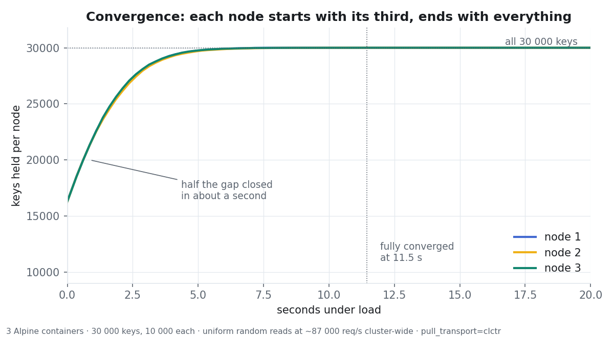
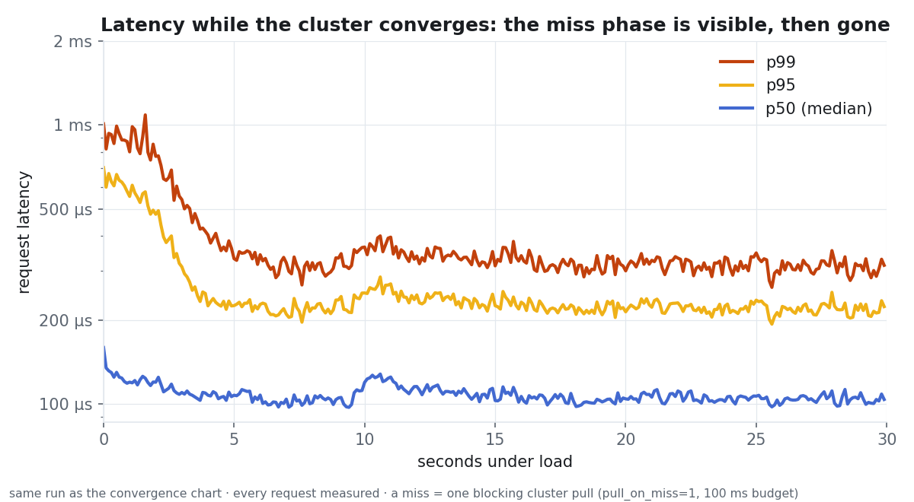
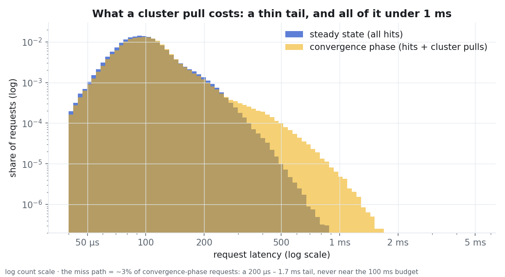
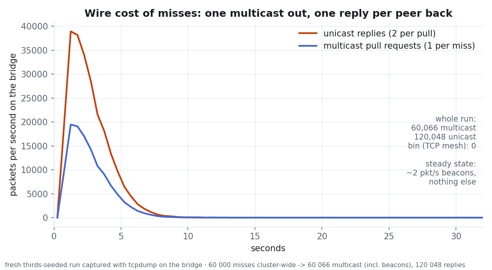
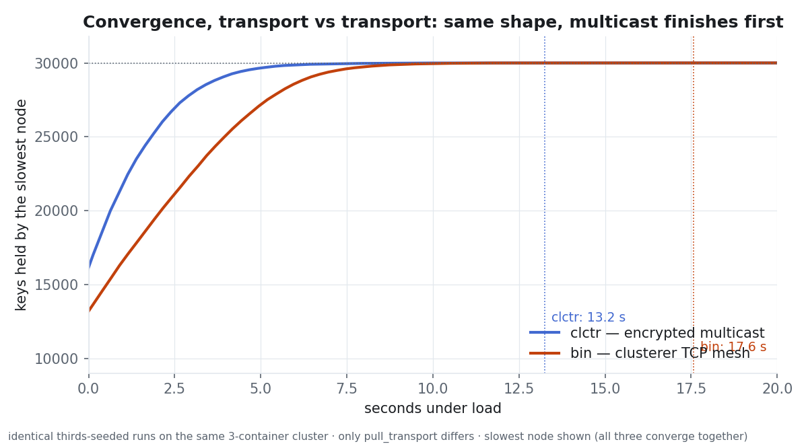
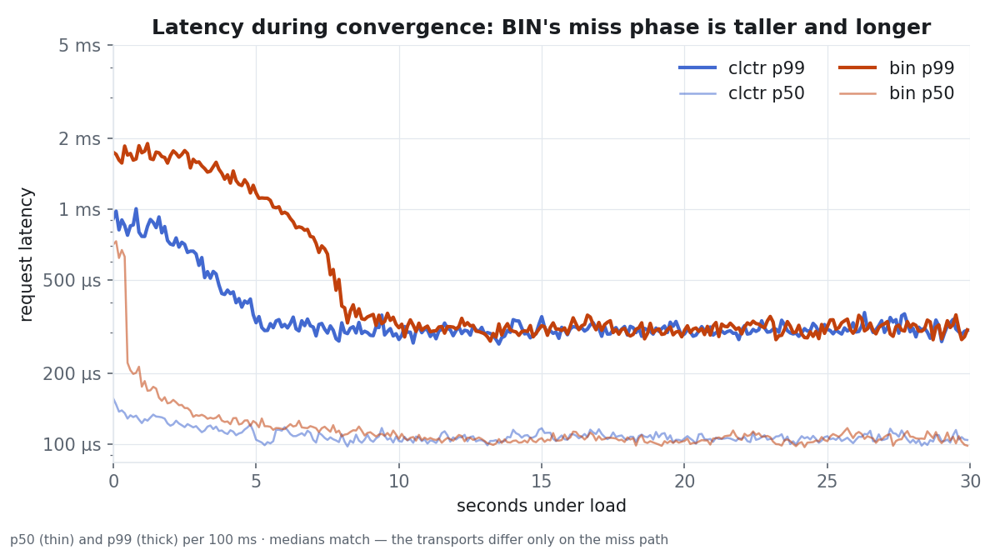
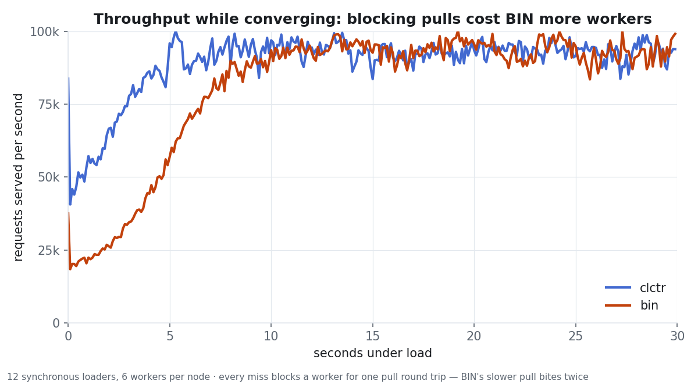
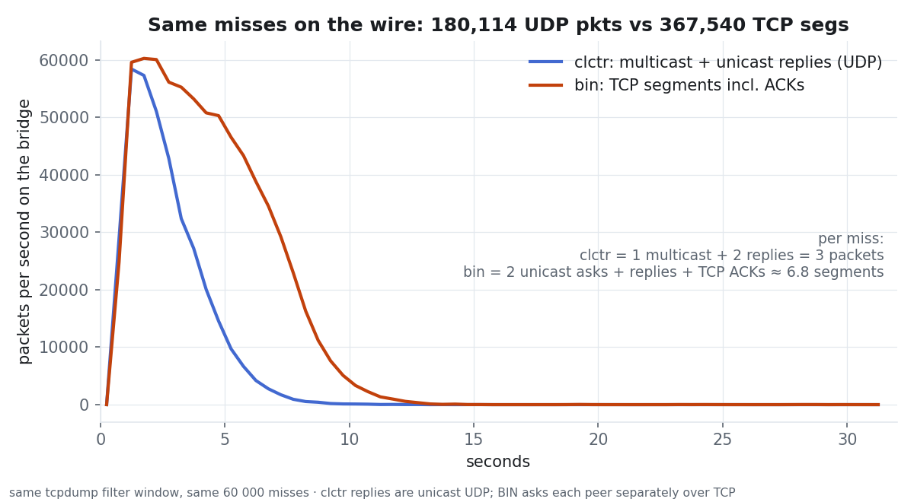

> **Superseded (2026-08-26).** The cross-node latency and convergence numbers
> in these archived notes were measured on a **single-host container bridge**
> (all three nodes on one kernel — no real network). Re-measured on three
> physical hosts with per-host containers and host networking: warm p50 is
> ~197 µs (not 105 µs), and full 30k-key convergence takes 17.5–20.8 s
> depending on transport (not 11.5–13.2 s). The current, authoritative
> measurements live in [STUDY.md — "Cross-node pull, measured on a real
> network"](STUDY.md#cross-node-pull-measured-on-a-real-network). The text
> below is kept verbatim as the historical record.

# cachedb_perf: progress notes from the pull request

The comments posted on OpenSIPS/opensips#4118 while the module grew - the
cross-node state-sharing preview and its transport comparison, the rebase,
and the cross-node pull commits with their captured outputs - moved here
verbatim so the PR thread stays short. Graphs are in `study/cp15-bench/`.

See also [STUDY.md](STUDY.md) for the measurements behind the module itself.


---

*2026-07-28*

## CP-15 preview: cross-node state sharing for cachedb_perf, measured on a 3-node containerized cluster

`perf://` as submitted in this PR is deliberately **node-local**: every read and write touches only local shared memory, which is where its performance comes from. CP-15 is the follow-up layer (developed, working, not yet part of this PR) that answers the one question a node-local cache cannot: *what happens when a request lands on a node that doesn't hold the state?*

The answer is **pull-on-miss read repair**. On a local miss in an opted-in collection, the node asks the cluster, stores the answer locally with its remaining TTL, and serves it — so state migrates towards wherever it is actually requested, one key at a time, and a second request for the same key is an ordinary local hit. Nothing is pushed eagerly and nothing participates unless named in `replicate_collections`; a fully-warm cluster behaves exactly like today's node-local module.

Two transports are selectable via `pull_transport`: `bin` (clusterer generic messages over the proto_bin TCP mesh) and `clctr` — one encrypted multicast packet per miss over the clusterer_controller UDP plane (XChaCha20-Poly1305, Noise_NNpsk0 join), with unicast replies. A short negative cache (`pull_negative_ms`, default 300 ms) stops broadcast storms for keys that exist nowhere; a miss waits at most `pull_timeout_ms` (default 50 ms), and all peers answering "not here" completes the wait early. The blocking form (`pull_on_miss=1`) is off by default; consumers can instead drive the pull through an exported API with an eventfd, which is how `topology_hiding` suspends the transaction instead of holding a worker.

To see how it behaves under sustained load — not just in a unit rig — I ran a 3-node cluster of Alpine containers (containerd/nerdctl on one 16-core host, dedicated bridge network, IGMP snooping off), built from the development branch at `-O3` with `F_MALLOC`. Workload: 30,000 keys, 12 synchronous loaders driving ~90,000 uniform-random reads/s cluster-wide through the SIP script path (`cache_fetch` on OPTIONS), every request timed, the control plane captured with tcpdump on the bridge.

### 1. Warm cluster: the feature costs nothing when it isn't needed

All 30,000 keys on every node, 45 s of load:

| Measurement | Result |
|---|---|
| Throughput | **90,457 req/s** (4.38 M requests, all 200) |
| Hit rate | **100.0%** |
| Latency | p50 **105 µs**, p99 **317 µs** (dominated by the SIP round trip) |
| Cluster pulls | **0** |
| Multicast packets | **0** (≈2 pkt/s of controller beacons only) |

This is the steady state a production cluster with call-id affinity lives in, and it is indistinguishable from the node-local module.

### 2. Each node holds one third — how fast does everyone hold everything?

Fresh seed: node 1 gets keys 0–9,999, node 2 gets 10,000–19,999, node 3 gets 20,000–29,999. Same uniform load against all three nodes, so two thirds of initial reads are misses:



Half of each node's 20,000-key gap closes in **about one second**; 99% by 7 s; **every node holds all 30,000 keys at 11.5 s** — while the cluster keeps serving **87,000 req/s** throughout. The exponential shape is inherent to read repair: hot keys arrive almost immediately, and the tail is just rarely-requested keys waiting to be asked for. (For a *planned* mass hand-over — node loss, re-hash — the `perf_sync` bulk path remains the right tool; it measured 23–45× faster than an equivalent pull storm.)

### 3. What a pull costs the request that triggers it





A pull is a **200 µs – 1.7 ms** event (multicast ask + first positive reply), visible on ~3% of convergence-phase requests. Cluster-wide p99 rose from 317 µs to **576 µs** during the heaviest miss phase and was back to baseline within seconds. Nothing approached the 100 ms budget; across 10 M+ requests in all scenarios there were **zero timeouts and zero failures**. Caveat for calibration: this is a single-host bridge network, so the wire is sub-millisecond — on a real LAN the pull cost is roughly one RTT plus these numbers, which is exactly the case where the eventfd/async form is worth using instead of the blocking one.

### 4. Wire accounting, to the packet



tcpdump on the bridge for a full thirds-seeded convergence:

| Packets | Count | Meaning |
|---|---|---|
| multicast :4499 | **60,066** | 60,000 misses × exactly 1 broadcast, plus beacons |
| unicast :4499 | **120,048** | exactly 2 replies per pull — every peer answers, positive or negative |
| proto_bin :5599 | **0** | the `clctr` transport really carries everything |

So the cost model for an N-node cluster is simply **1 multicast + (N−1) unicast replies per miss**, independent of cluster size on the request side, and ~2 pkt/s of beacons when idle.

### Where this lands

CP-15 lives on a development branch as module-scoped commits on top of this PR's branch (cachedb_perf: probe / pull / negative cache / async face / membership / stats; the consumer side on the topology_hiding branch; the messaging API on the clusterer_controller branch). It will be proposed once this PR merges, since it builds on the collection and stats layers introduced here. The defaults follow from the measurements above: everything opt-in, `pull_on_miss` off, blocking tolerable on a quiet LAN, suspension available where it matters, and bulk sync for planned hand-overs.


---

*2026-07-28*

## Follow-up: the same bench with `pull_transport=bin` — why the multicast transport is the default worth having

The pull layer deliberately supports two transports, so the choice ought to rest on a measurement rather than a preference. Same three containers, same 30,000 keys, same ~90,000 req/s workload as the previous comment; the **only** change between the two runs is the `pull_transport` modparam — `clctr` (one encrypted multicast ask, unicast replies) versus `bin` (clusterer generic messages over the proto_bin TCP mesh, one ask per peer).

| | `clctr` — encrypted multicast | `bin` — clusterer TCP mesh |
|---|---|---|
| Warm steady state | 90.5 k req/s, zero cluster traffic | 89.8 k req/s, zero cluster traffic — **identical** |
| Slowest node fully converged | **13.2 s** | 17.6 s |
| Convergence-phase p99 | **585 µs** | 1,319 µs |
| Throughput during the miss storm | ~50 k req/s | ~20 k req/s |
| Wire, same 60,000 misses | **180,114 UDP packets** (3 per miss) | 367,540 TCP segments (≈6.8 per miss) |



Same exponential shape — read repair fetches hot keys first regardless of transport — but BIN takes 4.4 s longer to finish, because each pull's slower round trip compounds through every blocked worker.



The medians are indistinguishable in both runs, which is the useful control: the transports genuinely differ **only on the miss path**. There, BIN's p99 starts near 2 ms against clctr's 1 ms and stays elevated roughly twice as long.



The operationally interesting one. With blocking pulls a slower transport bites twice — the request waits longer *and* the worker is unavailable longer — so BIN's throughput during the heaviest miss phase drops to ~20 k req/s against clctr's ~50 k. (The asynchronous form softens this for both transports; it does not change their ordering.)



The structural difference, counted rather than argued: BIN cannot broadcast, so every miss asks each peer separately over TCP and pays ACKs — twice the packets for identical work in a 3-node cluster. And the ratio is size-dependent in BIN's disfavour: the multicast ask stays **one packet at any cluster size**, while BIN's ask side grows as N−1.

Two honesty notes. First, this is a single-host bridge network — BIN's TCP overhead is at its kindest here; on a real network with loss and latency the gap widens. Second, BIN remains the right fallback where multicast is unavailable (some cloud fabrics), which is exactly why it exists as an option rather than being removed.

The full harness — image build, cluster bring-up, loaders, collector, capture wrapper, distilled per-run data and both chart generators — is committed on the development branch under `modules/cachedb_perf/bench/containers/`, so the whole comparison reproduces in a few minutes on any host with containerd.


---

*2026-08-06*

Rebased onto current master (clean, no conflicts - this module wasn't touched by the topology_hiding refactor happening elsewhere) and added one more small fix, found from a real production reading.

**Bug**: `hit_rate_note` only looks at the hit/miss ratio, so a collection that's had zero stores - nothing has ever been written to it, e.g. it loaded 0 rows from persistence at startup - gets the exact same note as a collection that's genuinely churning through entries faster than they're used: *"cached state is being lost or is expiring before it is used."* That's actively misleading for the zero-stores case, since there's no state to have been lost or expired if nothing was ever stored in the first place.

Caught live on a production node: a debug collection (`rtpdebug`) with `entries: 0, stores: 0, misses: 9` showed the "being lost or expiring" note, and the startup log confirmed `pcache_db_load: collection <rtpdebug>: loaded 0 entries` - it had been empty since the process started, not losing anything. The fix checks `stores == 0` before falling into that branch and reports a different, more accurate note pointing at "nothing is reaching this collection" instead of "tune your eviction/TTL."


---

*2026-08-09*

#### New commit: cross-node pull — ask the cluster before calling a miss

This is the follow-up trailed in the July benchmarks above, now landed as one
commit on top of the module (+3,799/−72, 22 files). It closes the gap between
the two sharing mechanisms the module already had: `perf_sync` moves *whole
collections* through a shared DB (right for bootstrap/failover, wrong for one
key), while this moves *one key, on demand, at miss time*.

**The shape of it.** Nodes behind a load balancer each run their own
cachedb_perf, so a key written on one node is a miss on every other. Now a miss
(on an opted-in collection) allocates a slot in a small shm pool, broadcasts
`(collection, key, id)` to the cluster, and any peer holding the key answers
with the value and its **remaining** TTL; the reply is stored locally with that
TTL. Opt-in is per collection via `replicate_collections` — a key is only worth
asking the cluster about if it means the same thing on every node, and only the
operator knows that.

**Blocking is explicit and bounded.** `pull_on_miss=1` makes a `cache_fetch`
miss wait (poll + eventfd) up to `pull_timeout_ms` (default 50) for the answer —
that is a worker parked per miss, fine on a maintenance path, priced accordingly
on a SIP path, and the module says so at startup. With it off, the pull still
happens and benefits the *next* lookup. A slot reaper (utimer, twice per timeout
window) releases every slot whose deadline passed — without it, a request that
fewer peers than expected answered would leak its slot *and* hang the blocked
worker forever, which is exactly the failure we hit in an early deployment; the
regression test for it ships in `bench/pullsoak/`. A miss the whole cluster
confirmed is remembered in a negative cache (`pull_negative_ms`), so a key that
exists nowhere does not re-interrogate the cluster per lookup.

**Transports, and what this PR does *not* depend on.** The default transport
`bin` rides the clusterer module's BIN links — one unicast per peer, no new
dependency. There is a second transport, `clctr`, that rides the
`clusterer_controller` module (PR #4074): one encrypted datagram reaches every
peer. That module is **optional at build time and at run time** — the coupling
is gated behind `CLUSTERER_CTRL_SUPPORT`, which only a tree that carries the
controller ever defines, so *this PR builds and runs standalone on master*
(verified both ways: a full build of exactly this branch with no controller in
the tree produces a `.so` with zero clctr symbols, and a live start with
`pull_transport=clctr` + `sync_cluster_id` set but neither module available
comes up serving node-local, logging the three WARNs of the ladder below). At run time the degradation
ladder is uniform and non-fatal: `clctr` requested but unavailable → WARN, fall
back to `bin`; clusterer unavailable too → WARN, pull and sync disabled, the
cache runs purely node-local. Missing cluster infrastructure never stops the
module from starting; only a genuinely invalid config (an unknown transport
name) does.

**Sizing is measured, not guessed.** A pull slot embeds its key/value bounds:
`pull_max_key` (default 128) and `pull_max_value` (default 512) size them, so
the 64-slot pool costs **50 KB** of shm at the defaults instead of the ~550 KB a
worst-case constant would take. Defaults come from measuring live collections
(values of 1–20 bytes under keys ≤33; sql_cacher rows ~70 bytes); dns_cache-
style users with multi-KB records raise `pull_max_value` and accept fewer slots
per KB. A value over the cap — or over what one datagram can carry — is
answered as *held-but-unsendable* rather than absent: the requester must not
conclude a key is missing from a node that demonstrably holds it.

**Failover hook.** `sync_shtag="name/cluster_id"` arms a sharing-tag callback:
the node becoming active reloads its collections from the DB snapshot, so a
standby that just took over does not serve stale state. Soft like everything
else — no DB or no clusterer means it logs and disarms.

**Observability.** Module stats `pull_requested/answered/served/timeouts/
negative_hits`, plus per-collection `pulled_in`/`served_out` (module-wide
counters cannot say *which* collection is converging). `perf_stats` gains a
`cluster.topology` object (this node's id, resolved IP and per-peer
reachability), and `perf_cluster_probe` actively asks every peer to answer for a
collection — "who is configured" and "who is actually reachable" fail
differently, so they are separate questions.

Running in production on our gateway fleet; the `bench/pullsoak/` rig drives
the e2e burst, the slot-leak regression, the oversize leg and the max-key
boundary against a real two-node cluster.


---

*2026-08-09*

#### Added: degraded-operation documentation, with captured outputs

Follow-up commit documenting exactly what each MI command, event and cachedb
surface does in the two degraded modes — every output below captured from a
live instance of this branch, not paraphrased. (Also in the admin guide as
§1.6 "Degraded operation", and the Dependencies section now names the two
*optional* modules instead of saying "None".)

**Mode 1 — clusterer loaded, `clusterer_controller` absent.** Only the clctr
transport is lost; pull and sync run over the clusterer's BIN links. One
startup WARN (two possible wordings — the build-time and run-time reasons read
differently):

```
WARNING:cachedb_perf:mod_init: pull_transport 'clctr' but this build carries
    no clusterer_controller support - falling back to 'bin'
WARNING:cachedb_perf:mod_init: pull_transport 'clctr' but clusterer_controller
    is not loaded - falling back to 'bin'
```

**Mode 2 — neither module available.** Pull and sync off, cache runs purely
node-local, three WARNs:

```
WARNING:cachedb_perf:mod_init: clusterer module not available - the cluster
    features are disabled; load clusterer before cachedb_perf
WARNING:cachedb_perf:mod_init: pull_transport 'clctr' but this build carries
    no clusterer_controller support - falling back to 'bin'
WARNING:cachedb_perf:mod_init: replicate_collections is set but the cluster
    is not available (needs sync_cluster_id + clusterer) - cross-node pull disabled
```

**Unaffected in both modes:** the whole local surface — `cache_store/fetch/
add/sub/remove("perf",…)`, `perf_del`/`perf_mget`/`perf_mget_json`, the local
MI set (`perf_get/set/probe/keys/scan/dump/ttl/del/stats/stats_reset`),
`perf_save`/`perf_load`/`db_mode`, and the four local events
(`E_CACHEDB_PERF_EXPIRED/NOMEM/GROWN/MEM_DEGRADED`).

**What changes, surface by surface:**

| surface | mode 1 (clusterer only) | mode 2 (neither) |
|---|---|---|
| `perf_pull nokey` | `{"source": "no-answer"}` — ran over bin, no peer held it | `500 "cross-node pull not active (replicate_collections)"` |
| `perf_cluster_probe` | probes over bin (lone node: `500 "…no peers, or no free pull slot"`) | `400 "cross-node pull is not active for this collection…"` |
| `perf_sync` | `{"collections": 2, "saved": 1, "broadcast": 2}` | `{"collections": 2, "saved": 1, "broadcast": 0, "note": "cluster sync inactive (no clusterer / cluster_id 0) - saved to the DB only"}` — the save still happens, it **never fails for cluster reasons** |
| `perf_stats` | full `cluster` object: ids, membership, pull counters, `"pull_slots": 64`, `topology` array | `cluster` object absent; per-collection stats identical, `pulled_from_cluster`/`served_to_cluster` stay 0 |
| `cache_fetch` + `pull_on_miss=1` | a miss on an opted-in collection blocks ≤ `pull_timeout_ms` asking the cluster | plain immediate miss — no blocking, no negative cache |
| `E_CACHEDB_PERF_SYNCED` | still fires when a peer's sync arrives | can never fire (nothing can arrive); subscribing costs nothing |

The one thing that still fails startup is a genuinely invalid config — an
unknown `pull_transport` name. Unavailable infrastructure never does.


---

*2026-08-09*

#### New commit: make a pull that never left the node visible

A cross-node pull datagram that the transport refused to send was logged at `LM_DBG`. That made it unreachable on any normal deployment — `log_level` 3 is INFO and `L_DBG` is 4 — so in practice nobody ever saw it.

That is the wrong level for this event. A send that fails produces no packet, so the far end never learns there was a question and the requester simply times out. This line is the only direct evidence of *why*, and it is the actual cause behind a class of "cross-node pull is slow / does not converge" reports.

It cannot become an unconditional `LM_WARN` either: a partitioned or overloaded peer fails every send, and an unbounded warning is its own incident. So it now warns on the first failure and then at most once every 30 s, folding in the count it stands for.

Details worth noting:

- **The rate-limit state is in shared memory, not a static.** A pull reply is sent by whichever worker happened to receive the request, so a per-process limiter would let every SIP worker warn once per interval each. Two workers can still race the interval check and both warn — deliberate, and cheaper than taking a lock on a failure path.
- **Applied to all four send sites**, not just the reply path: both reply paths (`clusterer_controller` unicast and BIN) and both request paths. A request that never goes out fails in exactly the same way.
- **New `pulls_send_failed` statistic and MI field**, so the exact total stays available while the log is suppressing. It is deliberately distinct from `pulls_timeout`: a timeout means a peer was asked and stayed silent, this means no peer was ever asked. Conflating them would hide a broken transport as peer slowness.


---

*2026-08-10*

#### New commit: store a pull answer that arrives after its caller gave up

A pull that times out can still be answered — the reply was merely late. Previously that answer was worthless: the waiter freed the request slot on its way out, a reply arriving after that failed the slot lookup and was dropped, and since the wire reply carries neither collection nor key, once the slot was gone the answer was uninterpretable. Net effect: the cache permanently re-asked for exactly the keys that are slowest to fetch — the worst possible convergence profile — and no counter recorded any of it.

Now a waiter that leaves empty-handed **orphans** the slot instead of freeing it. The slot keeps the collection, key and deadline, so a late reply still matches, and the reply path completes the store the waiter would have done. Final outcomes (a stored value, an oversize holder, a settled absence) still free the slot.

Design notes:

- The store happens **after** the pull lock is released, on copies taken under it — storing under it would serialise every node-wide pull behind one table write and nest the pull lock outside the bucket locks.
- The present-key check is `pcache_ht_probe() == 0`: allocation-free, and exactly 0 for a live key. A late answer never overwrites a live entry — this is read repair; a local write in the intervening window is by definition fresher.
- No in-flight TTL correction: the peer computes `ttl_left` immediately before sending, so charging the requester's elapsed time would subtract the peer's own delay from a figure that never included it.
- Optional `pull_linger_ms` (default 0 = off) bounds how late is too late, for deployments that *delete* keys; write-and-expire deployments need no bound because the value carries its own expiry.
- Orphans are bounded three ways: the existing reaper frees them at deadline + abandon; a stored orphan frees itself; and when the pool runs dry, allocation steals the longest-dead orphan — never a live pull. `pulls_in_flight` excludes orphans so the leak alarm doesn't fire on the ordinary outcome of a timeout.
- Six new statistics: `pulls_orphaned`, `pulls_late_stored`, `pulls_orphan_evicted`, `pulls_late_superseded`, `pulls_late_expired`, `pulls_orphan_expired`.

##### Verified fail-then-pass on two hosts

Two nodes on this branch over plain clusterer/BIN (no controller — the degraded-op path), `pull_timeout_ms=50`, and 100 ms of `tc netem` on the peer's BIN replies so every answer is guaranteed late (netem match confirmed by tc counters, not assumed):

| | before | after |
|---|---|---|
| fetch #1 | miss; reply vanished (`pulls_received=0`, nothing anywhere) | miss (same 50 ms give-up); `pulls_orphaned=1 → pulls_late_stored=1` |
| fetch #2 | miss again, `pulls_requested=2` — re-asks forever | **hit**, `pulls_requested` stays 1 — converged |

Waiter latency is unchanged in both cases; the difference is purely that the answer now lands.
