# cachedb_perf: the study and the measurements behind the module

Everything measured while building the `perf://` backend, moved here from
the text of the upstream pull request (OpenSIPS/opensips#4118) so the PR
stays short: the allocation-free read endpoint, how to enable the kernel
memory backing, the index-structure shootout, the concurrency and
read-protocol experiments, the memory-backing tiers, the in-process
comparison with `cachedb_local` and `cachedb_redis`, the end-to-end
topology-hiding runs at 50k and 100k held calls, the huge-page arena, the
design in brief, the script interface, and what the soak, production and
an adversarial review caught. The graphs are in `study/` next to this file.

The cluster-scale work that followed - pull-sharing at 1,000,000 contacts,
the allocator comparison and the cache's memory backings - is written up
in the README of the `feature/usrloc-pull-sharing-devel` branch.

### The allocation-free read — `get_buf` (new optional cachedb endpoint)

Profiling the read path (production `F_MALLOC` allocator) showed the biggest *removable* cost is not the lookup — it is the vtable contract. `get()` must return a value the caller owns and `pkg_free()`s, so every hit pays a `pkg_malloc` + `pkg_free` + second `memcpy` that exist only to satisfy ownership: a fixed **~70 ns/op** (15% of a 470 ns lookup over 50 000 entries; 30% of a 236 ns cache-resident one). `memcpy` itself never even appears in the profile.

So this PR adds a small, **optional** core endpoint — `get_buf()`, advertised by `CACHEDB_CAP_GET_BUF` — that reads into a buffer the caller already owns: no allocation, one copy instead of two. Any backend may implement it; every caller keeps `get()` as the fallback, and nothing about the existing endpoints changes (in particular `get_counter()` keeps its documented `{-2,-1,0}` return set).

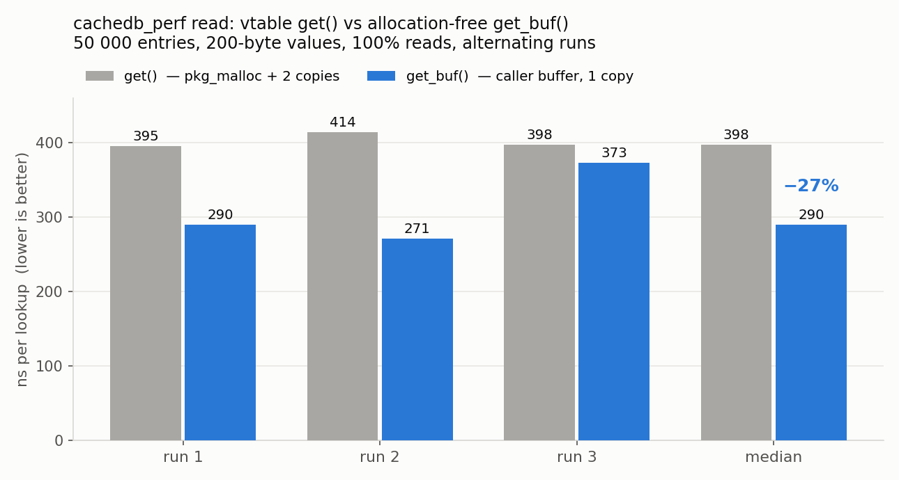

| 50k entries, 200-byte values, 100% reads | run 1 | run 2 | run 3 | median |
|---|---|---|---|---|
| `get()` ns/op | 395.3 | 414.2 | 397.7 | **397.7** |
| `get_buf()` ns/op | 290.1 | 271.0 | 372.7 | **290.1 (−27%)** |

Runs alternate get/get_buf in one binary to cancel warm-up bias; run-to-run variance on this box is real (one pair shows only −6%), so the honest claim is **20–27%**.

The contract is written for the failure cases, since those are what callers get wrong: the buffer must be private to the calling process; it may be written **speculatively** and abandoned, so its contents are undefined on any non-hit; `*vlen`/`*needed` are zeroed before anything else; and a value that does not fit reports its size via `*needed` while `*vlen` stays 0 — `{buf, *vlen}` is always a valid `str`. Inside cachedb_perf both entry points share one implementation of the seqlock read (optimistic loop, lock fallback, re-route retry, overflow leg, expiry), so they cannot disagree about which record they return.

The first consumer is `topology_hiding`'s `th_state_url` path (#4114): the conversion is written and tested (both the in-place path and the too-small→allocated fallback), and will be pushed to that PR **once this one merges**, since it needs this core endpoint to compile.

### Enabling the kernel memory backing

The huge-page arena (`arena_hugepage_mb`) climbs a **detect-by-trying** ladder at `mod_init`: it attempts each tier in turn and keeps the best one the running kernel actually grants — you do **not** pick a tier, you enable what you can and the module reports what it got. The tiers, fastest to slowest (the cost is the isolated 2 MB pointer-chase from §5 of the study):

| tier | kernel feature the module uses | one-time admin action | cost (2M chase) | swap-pinning |
|---|---|---|---|---|
| **1 (fastest)** | overcommit hugetlb pool + `MAP_HUGETLB` | one `sysctl` | **177 → 125 ns (1.42×)** | inherent — hugetlb is unswappable, no `mlock` needed |
| **2** | shmem THP + `MADV_HUGEPAGE` | one `sysfs` write | 177 → 158 ns | via `mlock` (see below) |
| **3** | `MADV_COLLAPSE` after fill | none (kernel ≥ 6.1) | 177 → 156 ns | via `mlock` (see below) |
| **4 (baseline)** | plain demand-faulted 4 KB | — | 177 ns | via `mlock` (still reserved+pinned) |

**Tier 1 — overcommit hugetlb** (the one to prefer: on-demand, nothing held while the cache is small, and no memlock grant needed). Allow enough on-demand 2 MB pages for the arena (`arena_hugepage_mb / 2`, plus a small margin):

```bash
sysctl -w vm.nr_overcommit_hugepages=320          # e.g. a 512 MB arena = 256 pages + margin
echo 'vm.nr_overcommit_hugepages = 320' > /etc/sysctl.d/60-opensips-hugepages.conf
```

**Tier 2 — shmem THP** (used if tier 1 is unavailable). Put shmem THP in `advise` so it honours the module's `MADV_HUGEPAGE`:

```bash
echo advise  > /sys/kernel/mm/transparent_hugepage/shmem_enabled
echo madvise > /sys/kernel/mm/transparent_hugepage/enabled
```

**Tier 3 — `MADV_COLLAPSE`** needs no sysctl (kernel ≥ 6.1); on some 6.12 builds it also wants tier 2's `shmem_enabled=advise`. **Tier 4** is the default and needs nothing.

**Swap-pinning (`mlock`) — tiers 2–4 only.** When tier 1 is unavailable the arena is a regular shared mapping, which the module `mlock`-pins pre-fork so it can't be swapped out from under the lock-free readers. systemd's default `LimitMEMLOCK=65536` (64 KB) makes that `mlock` fail on any real arena — the module then warns and runs **unpinned (swappable)**; the huge pages still form, they are just not pinned. Tier 1 (`MAP_HUGETLB`) is exempt and needs none of this. To pin tiers 2–4, grant it once:

```bash
mkdir -p /etc/systemd/system/opensips.service.d
printf '[Service]\nLimitMEMLOCK=infinity\n' > /etc/systemd/system/opensips.service.d/memlock.conf
systemctl daemon-reload
```

Turn it on and confirm what landed:

```
modparam("cachedb_perf", "arena_hugepage_mb", 512)   # 0 (default) = plain shm, tier 4
```
```bash
opensips-cli -x mi cachedb_perf:perf_stats     # -> memory_tier (1 hugetlb .. 4 plain 4K) + memory_backing
```

`mod_init` also logs the achieved tier and, when it falls short of tier 1, the exact `sysctl` to reach it and the measured cost of running without it.

## The study

Everything below was measured, not assumed — the benchmark rig ships in-tree (`modules/cachedb_perf/bench/`, `make run`, no OpenSIPS build needed) and every figure is reproducible. Hosts: Xeon E5-2699 v4, kernels 5.4 / 6.8 / 6.12; the NUMA numbers come from a vNUMA-pinned two-socket guest on the same silicon. The rig models structures and cache behaviour (single process, threads); it ranks designs rather than predicting server throughput.

### 1. The index structure

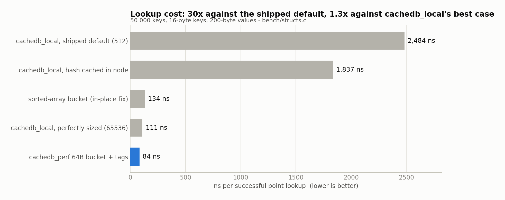

| design | @512 buckets (shipped default) | @65536 buckets |
|---|---|---|
| chained + `strncmp` (`cachedb_local` today) | 2484 ns | 111 ns |
| chained + hash cached in node | 1837 ns | 86 ns |
| sorted array per bucket + binary search | 134 ns | 100 ns |
| **64B cache-line bucket + 1-byte tags (this module)** | **84 ns** | |
| flat open addressing (rejected: stop-the-world resize) | 78 ns | |

Load factor alone is a **20× spread**. The chosen design is within 8% of the fastest structure measured, and the fastest one (flat open addressing) is impossible to resize across processes in shm. Also checked: `core_hash()` is *not* at fault (chi²/df 0.65–1.18 vs FNV-1a on thids, dialog ids, AoRs and call-ids — statistically indistinguishable), so the module keeps it.

### 2. Concurrency — an honest negative result

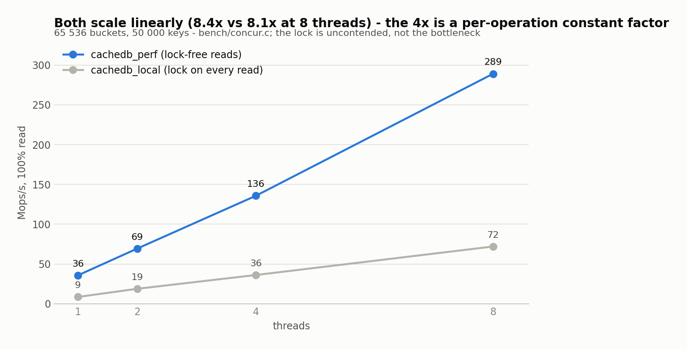

The hypothesis was that `cachedb_local`'s write-lock-on-every-read destroys scaling. **It does not**: with a well-sized table workers rarely collide on a bucket lock, and it scales 8.4× on 8 threads. The 4× gap is a **per-operation constant factor** (no atomic RMW on reads, one cache line per bucket, tag filtering) — not a scaling win. Against the shipped 512-bucket default the gap is ~90×.

### 3. The read protocol — measured before being believed

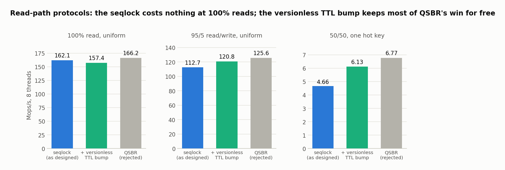

Readers take no locks: a per-bucket seqlock with bounded retries and a sleeping-lock fallback. What makes this legal in OpenSIPS specifically: shm is mapped once before fork and never unmapped, so a stale pointer read is garbage-but-not-a-fault, and the version re-check discards it — the value is always copied out inside the optimistic section, with every length clamped and every pointer extent-checked before use.

The one credible alternative (QSBR / pointer-publication, no version check at all) was implemented in the rig and **rejected on the numbers**: identical at 100% reads (on x86/TSO the version loads hit the already-loaded bucket line — the seqlock is free) and ahead only under single-hot-bucket write contention that SIP traffic doesn't exhibit (seqlock retries measured at 1.2 per 1000 reads on a uniform 95/5 mix). The useful piece survived without any grace-period machinery: a byte-identical `set()` that only refreshes the TTL — the dominant write in the motivating workload — takes the bucket lock but skips the version bumps and the memcpy entirely. One atomic `expires` store; concurrent readers of the bucket are undisturbed.

### 4. What was rejected: write staging and queueing

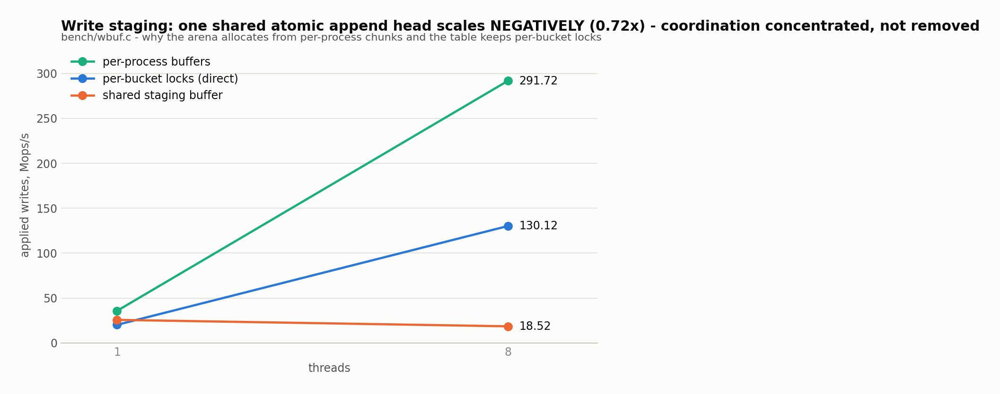

| queued writes, 8-thread budget | applied Mops/s | vs direct | ring full |
|---|---|---|---|
| 8 direct writers | **116.3** | 1.00× | — |
| 7 producers + 1 consumer | 24.1 | 0.21× | 99% |
| 4 producers + 4 consumers | 54.6 | 0.47× | 97% |

A shared staging buffer **loses** throughput as threads are added — one atomic append offset is a hotter point of coordination than thousands of bucket locks. Queued writes do less than half the work of writing directly, and break read-your-writes semantics. The rule this established shapes the whole module: per-process regions win for *allocation* (the arena uses them — zero atomics on the alloc fast path), but never for staging live entries.

### 5. Modern-kernel memory backing

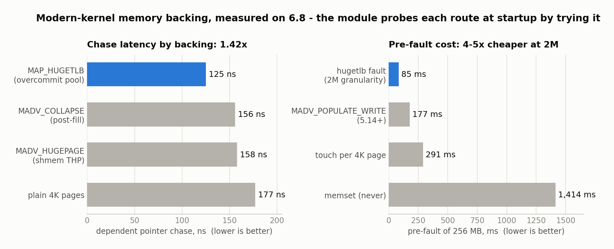

OpenSIPS shm today is demand-faulted 4K pages — no `MAP_POPULATE`, no hugepages, no `madvise`, no `mlock` anywhere in `mem/`. A multi-hundred-MB cache pays for that in TLB misses. Four routes to 2M pages, ranked as a runtime fallback ladder:

| route | admin action | 6.8 | 6.12 | chase latency |
|---|---|---|---|---|
| `vm.nr_overcommit_hugepages` + `MAP_HUGETLB` | one sysctl | works, **no reservation held** | works | **177→125 ns (1.42×)** |
| THP-shmem: `shmem_enabled=advise` + `MADV_HUGEPAGE` | one sysfs write | works | works | 177→158 ns |
| `MADV_COLLAPSE` after fill | **none** | works even with `shmem_enabled=never` | EINVAL — needs `advise` | 177→156 ns |
| plain 4K | — | — | — | baseline |

Key findings:
- **Overcommit hugetlb removes the classic reservation objection**: pages are taken from free memory at fault time and returned on exit — nothing is held hostage while the cache is small. Pre-faulting is also 4–5× cheaper at 2M granularity.
- **Every tier is detected at runtime by *trying it*, never by kernel version** — the 6.8/6.12 `MADV_COLLAPSE` divergence proves version checks lie, and they lie in both directions: a later 6.12 (6.12.96, Debian 13) collapses fine with `shmem_enabled=never` again — same major version, opposite behaviour, and the probe silently got the better tier. The module already does this in `mod_init`: it reports the achieved tier and, when hugetlb is unavailable, logs the exact sysctl and the measured cost of running without it.
- Two kernel subtleties learned the hard way (both documented in the code comments): **shmem THP requires the VA and the shmem file offset to be congruent mod 2M** (a range VA-aligned inside an unaligned mapping is silently ineligible — `THPeligible: 0`, collapse `EINVAL`; the fix is reserve `PROT_NONE`, then `MAP_FIXED` the shmem at a 2M boundary), and **a shmem `MADV_COLLAPSE` creates the huge folio without PMD-mapping the caller** — verify via the `ShmemHugePages` meminfo delta, not smaps.
- 1 GB pages: ruled out (runtime allocation unobtainable after any uptime, and 2M pages already give a ≤1 GB arena full STLB residency on this class of hardware).
- Swap pinning via `mlock` in `mod_init` works across fork (locks are not inherited, but the pages are shared — one pre-fork lock pins the arena for every worker). Found a production blocker on our own SBCs while checking: systemd's default `LimitMEMLOCK=65536` means `mlock` of any real arena fails — the unit needs a one-line drop-in.

### 6. Expiry

| strategy | per sweep (50k entries, ~13 due) | locks/sweep |
|---|---|---|
| full sweep, lock every bucket | 1.31 ms | 65 536 |
| **per-bucket `min_expires`, unlocked skip** | **0.044 ms** | **13** |
| timer wheel, O(expired) | 0.0005 ms | — |

Even the full sweep is 0.13% of a core — expiry is a *memory reclamation* problem (entries squatting up to `cache_clean_period`), not a CPU problem. The `min_expires` hint gets 30× for zero hot-path cost; the wheel's further 84× buys nothing and costs 74 ns/insert plus 16 B/entry.

### 7. NUMA — measured on a pinned two-socket testbed

| binding | dependent pointer chase |
|---|---|
| local (same socket) | 146.5 ns |
| remote (cross-socket) | 194.6 ns (**+33%**) |

Measured in-guest on a Proxmox VM with vNUMA bound per host socket (`numaN: ...,hostnodes=N,policy=bind`, dual E5-2699 v4 host — plain `numa: 1` without `hostnodes` fabricates topology over one memory domain and measures nothing). Two consequences, both already reflected in the design rather than motivating changes:

- Cross-socket **reads** of a shared cache cannot be sharded away — a worker reading an entry written on the other socket pays the remote latency however memory is partitioned; only replication avoids it. So the table is deliberately not NUMA-sharded (and §2 shows there is no lock contention for sharding to relieve either).
- The **write** side is node-local by construction: the arena's per-process chunk ownership means each worker faults — and therefore first-touch places — its own records on its own node.

Where NUMA does matter for the roadmap: page walks against remote memory amplify TLB-miss cost, so the huge-page backing is expected to be worth *more* on two sockets than the 1.42× measured on one — to be quantified in the end-to-end benchmark. One refinement from the same testbed: with `pdpe1gb` exposed, 1 GB pages *are* allocatable at runtime on a fresh boot (2 granted right after boot) — the earlier "unobtainable" holds only once uptime fragments memory. The ruling against them stands on arithmetic: 2 M pages already give a ≤1 GB arena full TLB coverage on this hardware.

## Measured: cachedb_perf vs cachedb_local, in-process

The bench rig above ranks *designs* in a single process. This measures the **real modules** — real OpenSIPS 4.1-dev, real shared memory, N real worker **processes** — driving the `th_store` access pattern (16-byte thid keys, 200-byte values, 95% get / 5% set). Both backends did byte-for-byte identical work (same 22.8 M hit count). Release build (`-O3`), `Q_MALLOC`, pinned to one 8-core socket.

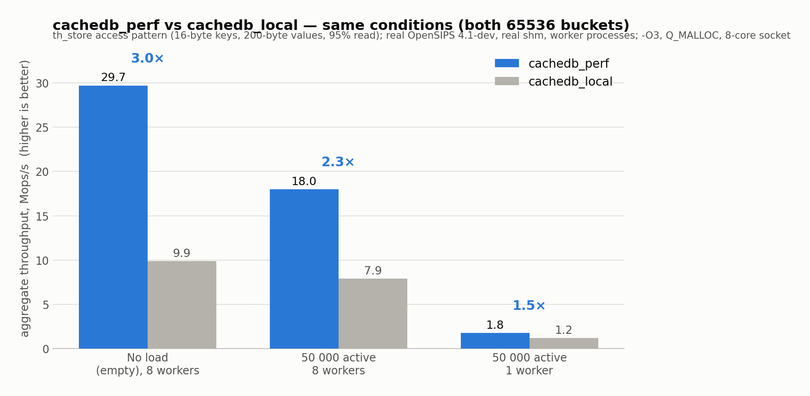

**Same conditions — both collections sized to 65536 buckets (`th=16`):**

| condition | cachedb_perf | cachedb_local | perf faster |
|---|---|---|---|
| no load (near-empty), 8 workers | **29.7 Mops/s** (271 ns/op) | 9.9 Mops/s (812 ns) | **3.0×** |
| 50 000 resident, 8 workers | **18.0 Mops/s** (448 ns/op) | 7.9 Mops/s (1013 ns) | **2.3×** |
| 50 000 resident, 1 worker | 1.8 Mops/s (558 ns) | 1.2 Mops/s (853 ns) | 1.5× |

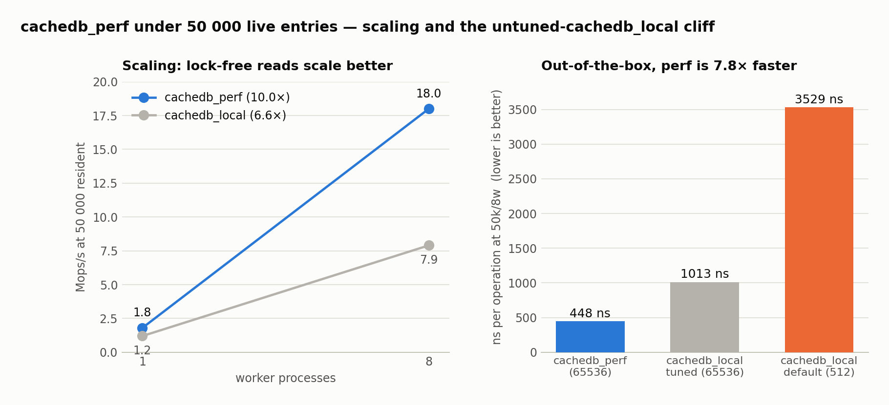

Two effects drive the gap. **Scaling:** cachedb_perf's lock-free reads scale **10.0×** from 1→8 workers vs cachedb_local's **6.6×** (it takes a bucket lock on every read). **The default:** most deployments never set `cache_collections`, so cachedb_local runs at its 512-bucket default — at 50k entries that is a load factor of ~98, **3529 ns/op**, and cachedb_perf is **7.8× faster** than cachedb_local as typically shipped.

| at 50 000 resident, 8 workers | ns per operation |
|---|---|
| cachedb_perf (65536 buckets) | **448 ns** |
| cachedb_local, tuned (65536 buckets) | 1013 ns |
| cachedb_local, default (512 buckets) | 3529 ns |

Honest notes: numbers include a real `pkg_malloc`+`free` of the 200-byte value on every get (the th_store copy-out), so this is per-operation cost, not a bare lookup. This deliberately isolates the **cache** from the SIP layer. In a full LB the per-call cost is SIP parsing, header manipulation and transaction state plus the th_store put/get — there is no per-call encryption (th_store values are stored in the clear; the only crypto is one cheap MD5 to derive the key), so the cache is a direct share of that cost. An end-to-end run under 50 000 held calls confirms the direction below.

### Is it only fast at reads? The mix swept, with `cachedb_redis` for scale

The numbers above use the `th_store` access pattern (95% get / 5% set), which invites a fair question: is this just a read cache that gives the win back on writes? It is not. Sweeping the read/write mix with `cdbbench` driving the `cachedb_funcs` vtable **directly** — no consumer module in the path — gives:

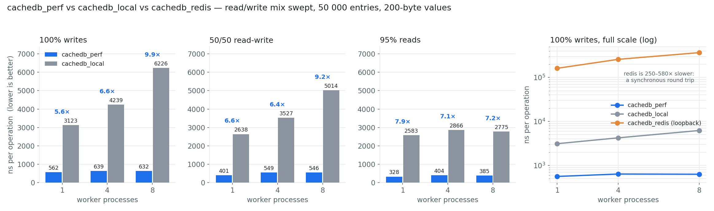

| ns/op (median of 3), 50 000 entries, 200-byte values | 1 worker | 4 workers | 8 workers |
|---|---|---|---|
| **100% writes** — cachedb_perf | **562** | **639** | **632** |
| **100% writes** — cachedb_local | 3123 | 4239 | 6226 |
| **100% writes** — cachedb_redis (loopback) | 161 138 | 257 458 | 366 320 |
| 50/50 — perf / local | 401 / 2638 | 549 / 3527 | 546 / 5014 |
| 95% reads — perf / local | 328 / 2583 | 404 / 2866 | 385 / 2775 |

**cachedb_perf is 5.6–9.9× faster than cachedb_local on *pure writes*, and the margin widens with concurrency** — cachedb_perf stays flat (562 → 639 → 632 ns as workers go 1 → 4 → 8) while cachedb_local degrades (3123 → 4239 → 6226). Writers in both take a bucket lock; the difference is what happens inside it. `cachedb_local`'s `add`/`set` path parses the stored value, reformats it and **reallocs the entry under the lock**, so the critical section grows with contention; cachedb_perf writes fixed-width fields in place under a seqlock bracket.

`cachedb_redis` over loopback is 250–580× slower here. That is not a criticism of Redis — it is the cost of a synchronous round trip per operation, and it is exactly why a local cache exists. Use Redis when state genuinely must be shared between nodes; use `perf://` when it must not leave the box.

### End-to-end: TH under 50 000 held calls

Same LB, topology_hiding with `th_state_url` pointing at each backend (65536 buckets), ramped while holding ~50 000 concurrent calls. "Sustained" means <5% failures **and** peak concurrency ≤75k (actually still holding 50k, not backlogging):

| offered CPS | th + cachedb_perf | th + cachedb_local |
|---|---|---|
| 4000 | 3875 achieved, 3.0% fail, 54k held | 3941 achieved, 1.4% fail, 57k held |
| 6000 | **5775 achieved, 3.7% fail, 68k held** ✓ | 5490 achieved, 8.5% fail, 94k (backlogging) ✗ |
| 8000 | 6670, 16.6% fail (overloaded) | 5874, 26.6% fail (overloaded) |

cachedb_perf **sustains the 6000-CPS rung where cachedb_local breaks** — a sustained-ceiling lift from ~3941 to ~5775 CPS (**~1.5×**) at 50k live th_store states. The end-to-end gain is smaller than the isolated-cache 2.3–7.8× because SIP processing is the larger share of per-call cost, but it lands exactly where the cache matters: the high-concurrency point where cachedb_local's lock-on-every-read serializes the workers.

### At 100 000 concurrent calls: cachedb_perf-TH vs dialog-TH vs no-TH

Pushing to **100 000 held calls**, comparing three topology-hiding strategies on the same LB (huge pages / THP enabled): cachedb_perf-backed th_store, the in-memory dialog module (`force_dialog`), and plain record-routing with no topology hiding at all.

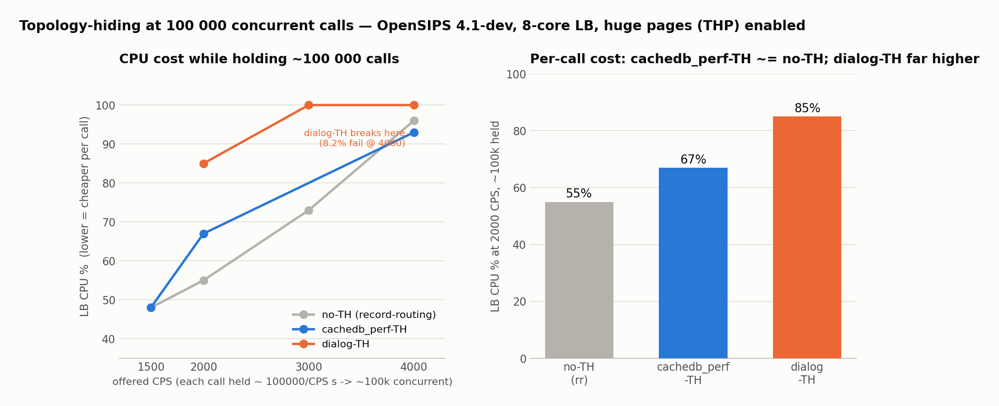

| offered CPS (≈100k held) | no-TH (rr) | cachedb_perf-TH | dialog-TH |
|---|---|---|---|
| 2000 | 55% CPU, 0% fail | 67% CPU, 2.9% | 85% CPU, 0.1% |
| 3000 | 73% CPU, 0.1% | — | **100% CPU**, 1.0% |
| 4000 | 96% CPU, 0.1% | 93% CPU, 1.3% | 100% CPU, **8.2% (breaks)** |

At 100k concurrency **cachedb_perf-TH is nearly as cheap as doing no topology hiding at all** — it tracks the no-TH curve and holds 4000 CPS at 93% CPU. **dialog-TH is the loser here**: it saturates CPU by 3000 CPS, breaks at 4000, and carries ~2.5× the resident memory (a full per-dialog state machine + timers vs one compact th_store entry). This is a crossover from lower concurrency, where dialog leads — cachedb_perf's flat per-entry cost wins as the live-state count climbs.

Caveats: the single load generator is unstable at 100k (some cachedb_perf mid-rungs showed generator-side failures at low LB CPU — discarded); and the huge pages here are whole-shm THP that benefits all three equally — the module's *own* huge-page arena is a separate mechanism, measured on its own in the next section.

### Re-verified end to end, with the backend's own counters as proof

The runs above were re-done with one addition: **every rung asserts, over MI, that the backend under test actually did the work** — `cachedb_perf:perf_stats` must show stores in the `th` collection and zero dialogs; the dialog arm must show `dialog:processed_dialogs` and zero cache stores; the no-TH arm neither. A rung that fails its assertion is reported invalid and discarded rather than silently contributing a number. All twelve rungs passed.

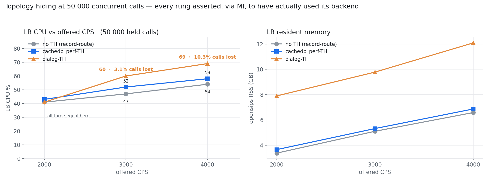

| 50 000 held calls | no TH | cachedb_perf-TH | dialog-TH |
|---|---|---|---|
| CPU @2000 CPS | 41% | 43% | 41% |
| CPU @3000 CPS | 47% | **52%** | 60% — 3.1% calls lost |
| CPU @4000 CPS | 54% | **58%** | 69% — **10.3% calls lost** |
| RSS @4000 CPS | 6.6 GB | **6.9 GB** | 12.1 GB |
| peak concurrency @4000 | 49 989 | 50 033 | 56 504 (backlogging) |

At 4000 CPS `cachedb_perf`-backed topology hiding costs **4 CPU points and 4% more memory than doing no topology hiding at all**, while holding concurrency at exactly 50k. Dialog-backed hiding costs 15 CPU points, 1.8× the memory, and is dropping 10.3% of calls — its rising "concurrency" is a backlog, not held calls. This is the same result as the 100k run above, now with the cache proven to have been exercised rather than assumed.

### Huge-page arena (CP-20)

The arena can now back its chunks with **2 MB huge pages** instead of 4 K (modparam `arena_hugepage_mb`; the reservation is 2M-aligned, mlock-pinned, created pre-fork and shared by all workers). Measured on the real module (−O3, 8 workers, medians of repeated runs):

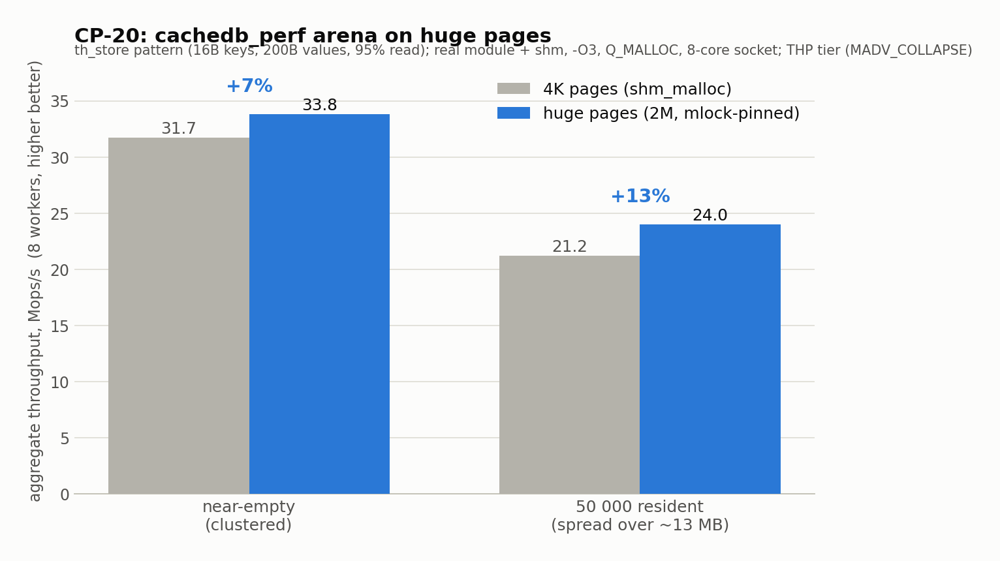

| condition | 4K pages | huge pages | gain |
|---|---|---|---|
| near-empty (clustered working set) | 31.7 Mops/s | 33.8 Mops/s | +7% |
| 50 000 resident (~13 MB working set) | 21.2 Mops/s | 24.0 Mops/s | **+13%** |

The gain is larger at 50k, where the working set spreads across enough memory to thrash the 4K TLB — exactly the case huge pages relieve. It's below the 1.19–1.43× the pointer-chase showed in isolation because each operation also pays for the hash, the tag scan and a copy of the value. Detection is by *trying* each tier (hugetlb → THP → collapse → 4K), never by kernel version; `mlock` wants `LimitMEMLOCK=infinity` and warns-and-continues otherwise.

## Cross-node pull, measured on a real network

*(2026-08-26: this section supersedes the earlier cross-node numbers, which
were measured on a single-host container bridge — three nodes on one kernel,
sub-millisecond "wire". Those runs understated convergence by roughly half
and warm latency by one LAN round trip. The historical figures remain in
[PR-NOTES.md](PR-NOTES.md), marked as superseded.)*

**Topology.** Three separate physical hosts on one L2 switch (measured UDP
round trip between them: 165 µs p50 / 325 µs p99). One container per host,
`--network host`, the same binary mounted into all three — the container only
pins the userland; every inter-node and client byte crosses the real NIC.
Twelve external OPTIONS loaders, ring-distributed so each node is driven from
a *different* host and the client leg crosses the wire too. 30k keys in a
`th=16` collection, `pull_on_miss=1`, `pull_timeout_ms=100`, `-a F_MALLOC`.
Two scenarios per transport: **warm** (all nodes fully seeded, 60 s) and
**thirds** (each node seeded with a disjoint third, 90 s — every node must
pull 20k keys under ~50k req/s of live load).

**Result: zero failures.** 3.4–5.0M requests per scenario, all answered, no
timeouts, and in every thirds run each node pulled almost exactly its missing
20,000 keys (20,000–20,006).

| transport | warm p50 / p99 | convergence p50 / p99 / p999 (max) | 99.9% converged |
|---|---|---|---|
| `udp` | 199 / 450 µs | 199 / 450 / 664 µs (8.8 ms) | **10.7 s** |
| `tcp` | 198 / 391 µs | 199 / 503 / 707 µs (11.9 ms) | 11.2 s |
| `bin` | 196 / 434 µs | 198 / **910 / 1462** µs (10.1 ms) | 14.2 s |

The last ~0.1% of convergence is bounded by when the final keys are first
*requested* (a coupon-collector tail of the random 30k keyspace, not a
transport property); observed 100% times were 17.5 / 19.3 / 20.8 s.

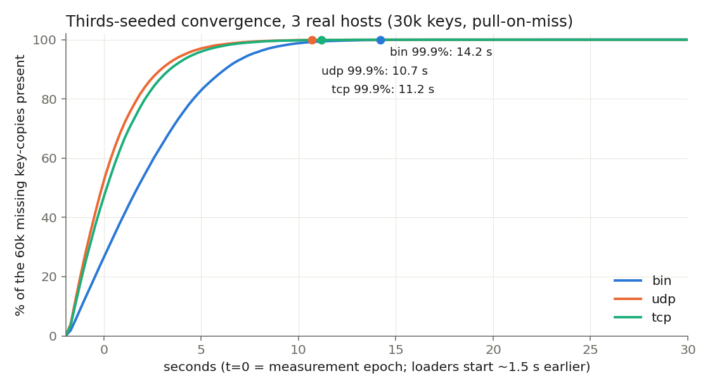

The medians are identical across transports and equal to the warm state —
a pull only ever touches the miss path. The whole difference lives in the
tail, which is exactly where the module-owned transports earn their place:

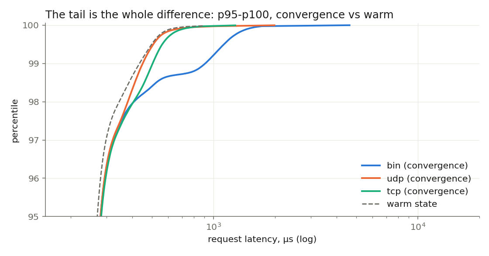

`bin` rides the clusterer's TCP links, and every message bounces through the
core's TCP main dispatcher; during the heaviest miss phase its p99 starts
near 2 ms and takes ~10 s to settle, while `udp`/`tcp` (own socket, dedicated
receive process) start under 0.9 ms and settle within ~5 s:

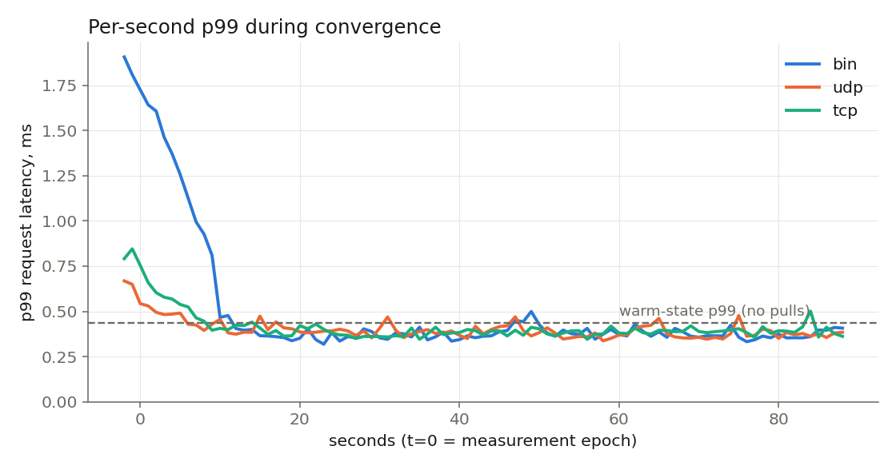

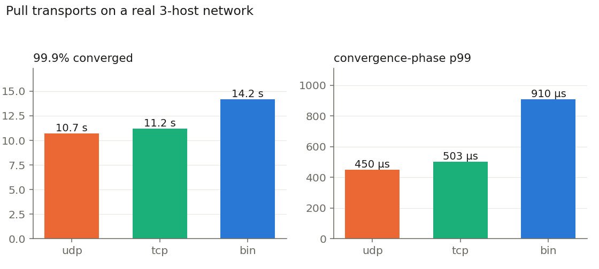

Warm-state figures across all transports sit at p50 ~197 µs / p99 ~390–434 µs —
the local-cache cost plus one real client round trip, with no cluster traffic
at all (`pulls: 0` throughout the warm runs). The `clctr` transport is not
measurable on this branch (the controller module is a separate PR); `bin`
remains the zero-configuration default, and the udp/tcp results above are the
case for using the module's own sockets on pull-heavy deployments.

## Design in brief

```c
struct pcache_bucket {          /* exactly one cache line - asserted */
    volatile unsigned version;  /* seqlock: even = stable, odd = writer inside */
    gen_lock_t        lock;     /* writers (+ reader fallback) */
    unsigned char     tags[6];  /* 1 byte of hash per slot - rejects ~255/256
                                   of non-matching slots without a deref */
    unsigned short    used:4,   /* slots in use */
                      owner:12; /* holder id, for dead-writer recovery */
    pcache_rec       *slot[6];
};
```

- **Slab arena**: entries live in fixed-size cells inside class-bound chunks that are *never* returned to shm — the invariant the lock-free read path stands on. Byte 0 of every cell is the class id, stamped at chunk-carve time and immutable, which is how a reader clamps a possibly-stale length without aligned chunks. Allocation state is per-process (bump chunk + private free stack per class; no atomics, no shared cache lines on the fast path).
- **Growth**: segmented directory + linear hashing — buckets never move, splits happen one bucket at a time (driven from the single maintenance timer), and the routing word is re-checked on a miss. The table **grows at runtime** instead of being sized once — the load-factor cliff that motivates this whole module cannot form.
- **No allocator call ever happens under a bucket lock** (`cachedb_local` nests the shm allocator inside bucket locks in five places); records are pre-built before `lock_get`, frees happen strictly after release.
- **Native counters**: `add`/`sub` store an int64 and accumulate fixed-width under the bucket lock; every user-facing read formats them as decimal. No parse/format/realloc in the critical section.
- **Overflow**: full buckets spill to a small chained side table gated by a counter readers check only after a stable miss; a key lives in its bucket or in overflow, never both.

## Script interface

Single-key operations go through the core cache functions unchanged. The module's own multi-key operations are **`perf_`-prefixed with Redis verbs** — deliberately *not* the `cachedb_local` parity names (`cache_remove_chunk` / `fetch_chunk`), so migrating those two calls requires a script change; everything else is drop-in:

```
perf_del("session-*");                          # glob delete -> count
perf_mget("user-*", $avp(k), $avp(v));          # matches -> index-paired AVPs
perf_mget_json("*", $var(j));                   # -> {"hits":"6","user-alice":"a1",...}
```

All three ride one lock-free walker (Redis SCAN-class guarantee) with binary-safe JSON escaping; `iter_keys` uses the same walker. Two startup selftest modparams (`arena_selftest`, `htable_selftest`) ship as permanent diagnostics and fail startup on any mismatch.

The same walker backs the **introspection MI** (full command table in the **MI commands** section above) — the operator visibility `cachedb_local` never had, and lock-free so a key scan never stalls SIP traffic. `perf_scan` is the answer for a large cache where `perf_keys` would truncate: its cursor is an ascending bucket index, so it stays valid across a concurrent resize and returns every entry present throughout at least once — without Redis's reverse-binary cursor masking, because the table only grows (buckets never move).

## Status

- [x] Module shell, URL/collection parsing (size clamped to [4,24] — `1 << size` on an unbounded unsigned is UB), memory-tier probe with actionable sysctl guidance
- [x] Slab arena (size classes, per-process allocation, donation/refill pools)
- [x] Table core: 64B buckets, SWAR tag scan, seqlock reads with full copy-out validation, versionless TTL bump, overflow
- [x] cachedb vtable: get/set/remove/add/sub/get_counter + native counters; `iter_keys`
- [x] `perf_del` / `perf_mget` / `perf_mget_json`
- [x] Selftests + script-level end-to-end suite
- [x] Expiry sweep — hint-routed (per-bucket min-expires hints in sweep-friendly parallel arrays, 16 per cache line; the hot TTL-bump path never writes them), timer-driven via `expiry_sweep_period` (default 1 s), reclamation through the global pool strictly after lock release
- [x] Statistics — per-process sharded counters (one 64-byte line per process, summed only at read time; a shared `update_stat` counter would recreate the 0.72× collapse measured above), exported as ten `cachedb_perf:` core stats and a per-collection `perf_stats` MI (load factor, overflow, seqlock retries/1k, backing tier, `expired`/`destroyed`, and a hit rate whose accompanying note follows the measured value rather than asserting a verdict). `perf_stats_reset` re-baselines the cumulative counters for a fresh measurement interval without a restart, leaving live gauges alone
- [x] Linear-hash growth + maintenance timer — the table now resizes itself (the thing `cachedb_local` fundamentally cannot do): one-bucket-at-a-time splits driven from the single-process maintenance timer, no rehash, overflow left findable; `growth_load_factor` keeps the bucket shape as entries scale. Verified: 1000 entries → 484 splits → 500 buckets, all keys intact
- [x] Introspection MI — `perf_keys` / `perf_scan` / `perf_dump` / `perf_get` / `perf_set` / `perf_ttl` / `perf_del` as MI commands, all lock-free (a key scan never stalls writers, unlike `cachedb_local`'s). `perf_scan` is cursor-based (Redis SCAN): an ascending bucket cursor, stable across a concurrent resize, every entry returned at least once. Verified over a datagram MI
- [x] Observability events (EVI) — `E_CACHEDB_PERF_EXPIRED` (per reaped key, opt-in per collection), `E_CACHEDB_PERF_NOMEM` (a write dropped because the arena is full), `E_CACHEDB_PERF_GROWN` (a table resized, with the before/after span), `E_CACHEDB_PERF_MEM_DEGRADED` (huge pages requested but the arena landed below hugetlb). Each `evi_probe_event()`-gated (free with no subscriber) and off the hot path; verified end-to-end over `event_route`s
- [x] Huge-page arena backing — 2M-aligned mlock-pinned reservation via the detect-by-trying ladder (`arena_hugepage_mb`), lock-free bump from it, shm_malloc fallback; measured +7–13% (see above)
- [x] Multi-process correctness soak — forked worker processes hammer one live backend (get/set/remove/add) while the maintenance timer splits buckets underneath them, checking four invariants: no torn read, no lost update, no lost key across splits, no crash/UAF. **Found and fixed a real fork-safety bug** (see below). Post-fix: 8 processes, 24M ops, 3093 concurrent splits, 0 crashes, `torn_reads=0`, counter sum == adds, all immortals intact; clean under the `Q_MALLOC_DBG` redzone allocator and under all three core allocators (`F_MALLOC` / `Q_MALLOC` / `HP_MALLOC`, driving both pkg and the arena's shm chunk backing)
- [x] **Portability** — built and exercised outside the usual glibc/x86 dev box, in containers: **Alpine 3.24** (musl 1.2, gcc 15.2) and **RHEL 9 / UBI9** (glibc 2.34, gcc 11.5). Zero warnings on either, with the arena/table selftests and the multi-process soak passing on both. The module needed no conditional compilation for musl; the one portability defect the exercise turned up was in the core rather than here (`lib/url.c` undefining `_GNU_SOURCE` before the headers that need it, which hides `clock_gettime`/`ctime_r` on musl), submitted separately as #4119
- [x] End-to-end `th_state_url` benchmark against `cachedb_local` (50k held calls) and against dialog-based topology hiding (100k held calls) — both sections above
- [x] DB persistence — whole-collection save/load to any `db_*` backend (`perf_save`/`perf_load` MI, plus `db_mode` startup-load / shutdown-save), TTLs kept as absolute wall-clock time so they survive a restart. The snapshot runs in a single transaction where the backend supports one, which makes it both fast and atomic — 30 000 entries save in 0.35 s on `db_sqlite` (against ~60 s and an aborted process before), and an interrupted save now rolls back rather than replacing a good snapshot with a partial one. Verified end to end with `db_sqlite` (save → shutdown-save → startup-load, values intact, TTL decremented across the cycle) and with `db_redis`, which takes no transaction and measures 5.05 s for the same rows. Rows whose wall-clock expiry has passed are dropped at load rather than merely skipped — otherwise, with `db_mode=1` or after any shutdown that was not graceful, dead rows accumulate in the table indefinitely. Single-node durability, not replication
- [x] **Cluster sync (`perf_sync`)** — MI command + script function that saves this node's collection to the DB, then signals peers over the `clusterer` API to reload it (one message per *sync*, not per operation); each peer reloads from the DB and raises `E_CACHEDB_PERF_SYNCED`. Soft dependency — degrades to a DB save with no broadcast if clusterer/`sync_cluster_id` is absent. A pull-from-DB refresh model for single-writer/read-replica topologies — deliberately *not* `/r`-style per-operation replication. Verified on a single-node cluster: the capability registers and lists in the clusterer's `clusterer_list_cap` MI (`cachedb-perf-sync`, state Ok), a soft `DEP_SILENT` clusterer dependency reorders init so it works regardless of load order, and `perf_sync` degrades cleanly with no clusterer — no crashes. Each collection also reports `last_sync_out` / `last_sync_in` / `last_sync_source` in `perf_stats` (shown only when `sync_cluster_id` is set): the clusterer's own `clusterer_list_cap` state of `Ok` for this capability only means *registered and enabled* — the module registers with `startup_sync=0` and takes no part in the clusterer's startup data-sync — so the honest convergence signal lives in the module's own stats. The multi-node broadcast→reload fan-out follows the `ratelimit` clusterer pattern and is **verified on a two-node cluster**: with both nodes pointed at one shared `db_sqlite` file and linked over `proto_bin`, `cachedb-perf-sync` registers on both, `perf_sync` on node 1 returns `{collections:1, saved:3, broadcast:1}`, and node 2 logs `cluster sync: reloading <sync> from DB (issued by node 1)`, reloads every key with its TTL intact and raises `E_CACHEDB_PERF_SYNCED` carrying `source_node=1`. Verified in both directions (node 2 → node 1 likewise, `source_node=2`)

- [x] **Read/write mix swept** — 5.6–9.9× over `cachedb_local` on pure writes (flat vs degrading as workers rise), and an assertion-verified end-to-end three-way where perf-TH lands within 4% of no-TH on CPU and memory
- [x] **Allocation-free read** — the optional `get_buf()` cachedb endpoint (`CACHEDB_CAP_GET_BUF`) and its cachedb_perf implementation; one shared read path for both entry points; measured 397.7 → 290.1 ns/op at the median (table above)

### Correctness: what the multi-process soak caught

A lock-free read path plus a table that resizes itself under live traffic is exactly the kind of code where a single-process selftest passes and production still corrupts memory. So the soak (`bench/cdbstress.c`) runs the real thing: 8 worker **processes** on one shared backend, a get/set/remove/add mix, with the maintenance timer splitting buckets the whole time. Every value is written all-bytes-equal so a torn read is visible; counters are hammered with `add(+1)` so a lost update shows as a shortfall; a set of keys is inserted once and never removed so a split that drops one shows as a miss.

It failed inside a second — a segfault on an *impossible* size class (88) read out of a cell's class byte. Root cause: after `fork()` every child holds a copy-on-write copy of the parent's private allocator hoard (same bump pointer, same free-list cell addresses), and `pcache_arena_child_init` had each child *donate* that hoard to the global pool. The identical physical cells were enqueued once per child, popped by several processes at once, and written through concurrently — one process's value byte landed on another's class id. The fix: a child drops its inherited copy and carves its own chunk on first use, never donating cells it doesn't own. After it, the full soak is clean — 24M ops, 3093 concurrent splits, no torn reads, counter sum equals total adds, every immortal key intact — and equally clean under the `Q_MALLOC_DBG` redzone allocator and under each of OpenSIPS' three core allocators (`F_MALLOC`, `Q_MALLOC`, `HP_MALLOC`), which back both the per-process state and the arena's shm chunk allocation.

### And what production caught that the soak did not

The soak runs a single collection with generous TTLs, so it never combined
overflow chaining with expiry reclamation — and that combination was the one
that mattered. On a live SBC the module crashed repeatedly inside the arena's
free path, on an impossible size class, with topology-hiding keys going
missing.

`struct povf`, the overflow node, had its `next` pointer at **offset 0** — but
byte 0 of every arena cell is the size class, read by both free paths. Linking
a node wrote the pointer's low byte over the class id (0x40/0x80/0xC0 →
"class" 64/128/192), indexing past the 21-entry class table and corrupting the
pool, so the crash surfaced far from the cause. It needs overflow *and* the
expiry sweep together to trigger, which is why a table with room to spare never
showed it.

The fix reserves byte 0 in `struct povf` and hardens both free paths to log and
leak on an invalid class rather than corrupt. Reproduced deliberately
afterwards — a churn set with a 2 s TTL, a 1 s sweep and growth enabled catches
it in under a minute — and the soak was extended to cover the same shape.

### And what an adversarial design review caught before it shipped

Designing `get_buf` began with a red-team pass over the read/write protocol, which found three latent defects in the *existing* code — each now a separate commit:

1. **A seqlock write-ordering hole on weak memory models.** Every version bump used a RELEASE RMW; release is one-way and permits the payload stores that follow to be observed first, so on aarch64/ppc64le a reader could sample an even version, copy a half-written record, re-check the same even version and accept the tear. All bumps are now ACQ_REL (the same reason the kernel writes `seq++; smp_wmb()`); x86-64 was never affected, which is exactly why no soak had caught it.
2. **`rflags` survived an in-place overwrite.** Storing an 8-byte string over a key that had been a native counter left `PCACHE_F_INT` set, and the read path then formatted the ASCII as an int64: `cache_store("…","12345678")` read back as `4050765991979987505`. The flag is now cleared inside the version bracket.
3. **The copy clamp could wrap.** `PCACHE_REC_HDR + klen + vlen > bound` on unsigned values wraps for a torn `vlen`, skipping the clamp on the one path that needs it; it is now subtractive and cannot wrap.

The standalone rig behind every figure above lives in `modules/cachedb_perf/bench/` (`make run`, no OpenSIPS build needed) — full measurement history, every rejected alternative and why — so the numbers here are reproducible rather than asserted.


