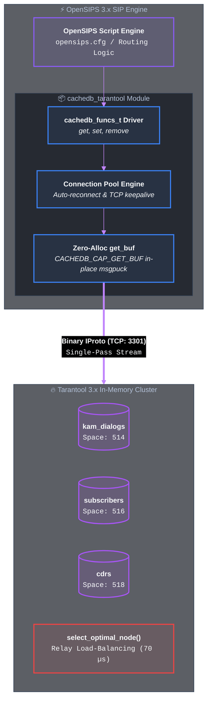

## Admin Guide

### Overview

The `cachedb_tarantool` module is an official-grade OpenSIPS 3.x CacheDB driver implementing the `cachedb_funcs_t` interface for **Tarantool 3.x**. It provides binary IProto communication, connection pooling, and direct stored procedure execution from OpenSIPS routing scripts.

It acts as a high-performance in-memory state backend for dialog session synchronization, user location clustering, and real-time RTPEngine node selection.

### Advantages

- **Zero BGSAVE Fork Jitter:** Eliminates Copy-On-Write latency spikes (18–20 ms in Redis) by using continuous Streaming Write-Ahead Logging (WAL).
- **Unified In-Memory State Plane:** Enables atomic pre-call rating, balance verification, and instant rich CDR generation directly via `tarantool_call` in < 0.2 ms.
- **Superior Asymmetric Routing (1-Hop vs 2-Hop P2P Mesh):** Centralized atomic session resolution achieves **1,003.4 CPS** (vs 558.2 CPS in P2P Pull-Mesh) and **0.451 ms P50 BYE latency** (vs 1.370 ms).
- **O(log N) Secondary Indexing:** In-memory `TREE` indexes on `node_id`, `state`, and `expires_at` enable instant multi-attribute lookups and sub-2ms failover recovery.
- **Server-Side LuaJIT Processing:** Real-time routing heuristics (`select_optimal_node`) execute directly inside Tarantool in **70 µs**.
- **Memory Efficiency:** Compact binary MessagePack tuples reduce memory usage by 52% compared to plain string storage.
- **Zero-Allocation Buffer Path:** Implements `tarantool_get_buf` (`CACHEDB_CAP_GET_BUF`) for direct single-pass decoding without intermediate heap allocations.

---

### Architecture



---

### Dependencies

#### OpenSIPS Modules

The following modules must be loaded before this module:
- *none* (optionally `cachedb_local` if multi-tier caching is used).

#### External Libraries or Applications

The following libraries or applications must be installed before running OpenSIPS with this module loaded:
- *none* (uses built-in lightweight MessagePack encoder and non-blocking IProto socket engine).

---

### Tarantool Server Setup & Schema

The `cachedb_tarantool` driver interacts with a running **Tarantool 3.x** instance. You can launch or integrate the backend using any of the following approaches:

#### 1. Instant Docker Container
```bash
docker run -d --name tarantool-voip -p 3301:3301 lean1ee/tarantool-voip-backend:latest
```

#### 2. Minimal Lua Schema Definition (for Existing Tarantool Instances)
```lua
-- Create rtpe_calls space (ID: 512) and secondary indexes
local calls = box.schema.space.create('rtpe_calls', { if_not_exists = true })
calls:format({
    { name = 'call_id',    type = 'string' },
    { name = 'node_id',    type = 'string' },
    { name = 'state',      type = 'string' },
    { name = 'created_at', type = 'unsigned' },
    { name = 'updated_at', type = 'unsigned' },
    { name = 'expires_at', type = 'unsigned' },
    { name = 'payload',    type = 'any' },
})
calls:create_index('primary', { parts = { 'call_id' }, if_not_exists = true })
calls:create_index('by_node', { parts = { 'node_id', 'updated_at' }, if_not_exists = true, unique = false })
calls:create_index('by_expire', { parts = { 'expires_at' }, if_not_exists = true, unique = false })
```

*Complete server templates and Lua stored procedures:* [lean1ee/tarantool-voip-backend](https://github.com/lean1ee/tarantool-voip-backend).

---

### Exported Parameters

#### `cachedb_url` (string)

Specifies the target Tarantool server connection URL in format `tarantool://[user:password@]host:port[/space_id]`.

*Default value:* `none`.

```cfg
modparam("cachedb_tarantool", "cachedb_url", "tarantool://127.0.0.1:3301/512")
```

#### `connect_timeout` (integer)

Connection timeout in milliseconds when establishing socket connections to Tarantool.

*Default value:* `500` ms.

```cfg
modparam("cachedb_tarantool", "connect_timeout", 500)
```

#### `query_timeout` (integer)

Timeout in milliseconds for IProto query and stored procedure execution.

*Default value:* `1000` ms.

```cfg
modparam("cachedb_tarantool", "query_timeout", 1000)
```

#### `pool_size` (integer)

Number of IProto TCP connections maintained in the pool per OpenSIPS worker process.

*Default value:* `4`.

```cfg
modparam("cachedb_tarantool", "pool_size", 8)
```

#### `lazy_connect` (integer)

Controls connection establishment mode. When set to `1`, connections to Tarantool are opened on first query rather than during module child initialization.

*Default value:* `0` (connect immediately at startup).

```cfg
modparam("cachedb_tarantool", "lazy_connect", 0)
```

#### `disable_time` (integer)

Number of seconds a malfunctioning Tarantool server instance remains disabled after exceeding error thresholds before reconnection is attempted.

*Default value:* `10` seconds.

```cfg
modparam("cachedb_tarantool", "disable_time", 10)
```

#### `allowed_errors` (integer)

Number of consecutive communication or protocol errors allowed before temporarily marking the Tarantool server as disabled.

*Default value:* `3`.

```cfg
modparam("cachedb_tarantool", "allowed_errors", 3)
```

#### `init_without_tarantool` (integer)

Allows OpenSIPS to proceed with initialization and startup even if the configured Tarantool cluster node is currently unreachable.

*Default value:* `1` (enabled).

```cfg
modparam("cachedb_tarantool", "init_without_tarantool", 1)
```

#### `tcp_keepalive` (integer)

Enables or disables TCP keepalive on active database connections (1 = enabled, 0 = disabled).

*Default value:* `1`.

```cfg
modparam("cachedb_tarantool", "tcp_keepalive", 1)
```

---

### Exported Functions

#### `tarantool_call(proc_name, params, result)`

Executes a stored procedure on the Tarantool server and stores the return tuple in a script variable.

```cfg
route[CHOOSE_MEDIA_NODE] {
    if (tarantool_call("select_optimal_node", "$ci", "$var(selected_node)")) {
        xlog("L_INFO", "Routing call to media node: $var(selected_node)\n");
        $var(rtpengine_sock) = "udp:" + $var(selected_node) + ":22222";
    }
}
```

#### `tarantool_eval(lua_expr, params, result)`

Evaluates arbitrary Lua code directly inside the Tarantool server instance.

```cfg
route {
    tarantool_eval("return box.space.rtpe_calls:count()", "[]", "$var(active_calls)");
}
```

---

### Generic CacheDB Interface

The module fully implements OpenSIPS core `cache_store`, `cache_fetch`, `cache_remove`, and `cache_raw_query` commands:

```cfg
route {
    # Store session state (TTL = 3600s)
    cache_store("tarantool", "$ci", "$var(session_payload)", 3600);

    # Fetch session state
    if (cache_fetch("tarantool", "$ci", "$var(session_payload)")) {
        xlog("L_INFO", "Found active session: $var(session_payload)\n");
    }

    # Raw Lua query evaluation
    cache_raw_query("tarantool", "return box.space.rtpe_calls:get('$ci')", "$var(reply)");

    # Remove session
    cache_remove("tarantool", "$ci");
}
```

---

### Full opensips.cfg Example

```cfg
# OpenSIPS Production Routing Configuration with Tarantool CacheDB & RTPEngine

loadmodule "sl.so"
loadmodule "tm.so"
loadmodule "rr.so"
loadmodule "maxfwd.so"
loadmodule "rtpengine.so"
loadmodule "cachedb_tarantool.so"

# Configure Tarantool CacheDB connector
modparam("cachedb_tarantool", "cachedb_url", "tarantool://127.0.0.1:3301/512")
modparam("cachedb_tarantool", "connect_timeout", 500)
modparam("cachedb_tarantool", "query_timeout", 500)
modparam("cachedb_tarantool", "pool_size", 8)
modparam("cachedb_tarantool", "init_without_tarantool", 1)

# Default fallback RTPEngine socket
modparam("rtpengine", "rtpengine_sock", "udp:127.0.0.1:22222")

route {
    if (!mf_process_maxfwd_header(10)) {
        sl_send_reply(483, "Too Many Hops");
        exit;
    }

    if (is_method("INVITE")) {
        record_route();

        # 1. Query Tarantool stored procedure to select optimal least-loaded media relay
        if (tarantool_call("select_optimal_node", "$ci", "$var(selected_node)")) {
            xlog("L_INFO", "Optimal RTPEngine node selected: $var(selected_node)\n");
            $var(rtpengine_sock) = "udp:" + $var(selected_node) + ":22222";
        }

        # 2. Store session state with 3600s TTL
        cache_store("tarantool", "$ci", "active", 3600);

        # 3. Engage media relay
        rtpengine_offer("replace-origin replace-session-connection");
        t_on_reply("handle_nat");
    } else if (is_method("BYE|CANCEL")) {
        cache_remove("tarantool", "$ci");
        rtpengine_delete();
    }

    if (!t_relay()) {
        sl_reply_error();
    }
}

onreply_route[handle_nat] {
    if (status =~ "(183)|(200)") {
        rtpengine_answer("replace-origin replace-session-connection");
    }
}
```

